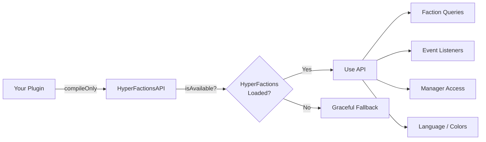

# HyperFactions Developer API Reference

> **Version**: 0.13.0 | **Package**: `com.hyperfactions.api`

This document is for third-party mod developers who want to hook into HyperFactions from their own plugins.

---

## Table of Contents

- [Getting Started](#getting-started)
- [Faction Queries](#faction-queries)
- [Power System](#power-system)
  - [Hardcore Power Mode](#hardcore-power-mode)
- [Territory](#territory)
- [Relations](#relations)
- [Zones](#zones)
  - [Zone Queries](#zone-queries)
  - [Zone Flags](#zone-flags)
  - [Zone Settings](#zone-settings)
- [Combat](#combat)
- [Protection](#protection)
  - [ProtectionChecker.InteractionType](#protectioncheckerinteractiontype)
- [Language / i18n](#language--i18n)
- [Chat Color Customization](#chat-color-customization)
- [World Settings](#world-settings)
- [Configuration](#configuration)
- [Manager Access](#manager-access)
- [Economy API](#economy-api)
- [Event System](#event-system)
  - [Post-Events](#post-events)
  - [Cancellable Pre-Events](#cancellable-pre-events)

---

## Getting Started

### Dependency Setup

Add the JitPack repository and HyperFactions as a compile-only dependency in your `build.gradle`:

```gradle
repositories {
    maven { url 'https://jitpack.io' }
}

dependencies {
    compileOnly 'com.github.HyperSystems-Development:HyperFactions:v0.13.0'
}
```

Add the soft dependency in your `manifest.json`:

```json
{
  "optionalDependencies": {
    "HyperSystems:HyperFactions": "0.13.0"
  }
}
```

### Runtime Detection

Always check availability before calling API methods:

```java
import com.hyperfactions.api.HyperFactionsAPI;

if (HyperFactionsAPI.isAvailable()) {
    Faction faction = HyperFactionsAPI.getPlayerFaction(playerUuid);
    // Safe to use
}
```



---

## Faction Queries

| Method | Returns | Description |
|--------|---------|-------------|
| `getFaction(UUID factionId)` | `@Nullable Faction` | Get faction by ID |
| `getFactionByName(String name)` | `@Nullable Faction` | Get faction by name (case-insensitive) |
| `getPlayerFaction(UUID playerUuid)` | `@Nullable Faction` | Get a player's faction |
| `isInFaction(UUID playerUuid)` | `boolean` | Check if a player is in any faction |
| `getAllFactions()` | `Collection<Faction>` | Get all factions |
| `getFactionCount()` | `int` | Get total number of factions on the server |
| `getFactionClaimCount(UUID factionId)` | `int` | Get number of claims a faction holds |
| `getFactionClaims(UUID factionId)` | `Set<ChunkKey>` | Get all chunk claims for a faction |

### Example

```java
Faction faction = HyperFactionsAPI.getPlayerFaction(playerUuid);
if (faction != null) {
    String name = faction.name();
    UUID leaderId = faction.getLeaderId();
    int memberCount = faction.getMemberCount();
    int claimCount = HyperFactionsAPI.getFactionClaimCount(faction.id());
}

// Server stats
int totalFactions = HyperFactionsAPI.getFactionCount();
```

---

## Power System

| Method | Returns | Description |
|--------|---------|-------------|
| `getPlayerPower(UUID playerUuid)` | `@NotNull PlayerPower` | Get player's power data |
| `getFactionPower(UUID factionId)` | `double` | Get faction's total power |
| `getFactionPowerStats(UUID factionId)` | `@NotNull FactionPowerStats` | Get detailed power statistics |
| `isFactionRaidable(UUID factionId)` | `boolean` | Check if faction is raidable (power < claims) |
| `isHardcoreMode()` | `boolean` | Check if hardcore power mode is enabled |
| `getFactionHardcorePower(UUID factionId)` | `double` | Get faction's hardcore power pool (-1 if not found) |

### FactionPowerStats Record

```java
record FactionPowerStats(
    double currentPower,
    double maxPower,
    int currentClaims,
    int maxClaims
) {
    int getPowerPercent()     // Power as percentage (0-100)
    boolean isRaidable()      // True if currentClaims > maxClaims
    int getClaimDeficit()     // How many claims over capacity
}
```

### Hardcore Power Mode

When `isHardcoreMode()` is true, faction power works differently:

- **Normal mode**: Faction power = sum of all members' individual power. Each member has their own power that regenerates independently.
- **Hardcore mode**: Faction power is a single shared pool. Power loss from deaths is deducted from the pool, and regeneration is applied to the pool as a whole (only while at least one member is online, unless `regenWhenOffline` is enabled).

Use `getFactionHardcorePower()` to read the hardcore pool value directly. In hardcore mode, `getFactionPower()` automatically returns the hardcore pool value instead of the member sum.

### Example

```java
PlayerPower power = HyperFactionsAPI.getPlayerPower(playerUuid);
double current = power.power();
double max = power.maxPower();

// Detailed faction power stats
var stats = HyperFactionsAPI.getFactionPowerStats(factionId);
if (stats.isRaidable()) {
    // Faction can be overclaimed!
    int deficit = stats.getClaimDeficit();
}

// Hardcore mode check
if (HyperFactionsAPI.isHardcoreMode()) {
    double hardcorePower = HyperFactionsAPI.getFactionHardcorePower(factionId);
    // hardcorePower is the shared pool value (-1 if faction not found)
}
```

---

## Territory

| Method | Returns | Description |
|--------|---------|-------------|
| `getClaimOwner(String world, int chunkX, int chunkZ)` | `@Nullable UUID` | Get faction ID owning a chunk |
| `isClaimed(String world, int chunkX, int chunkZ)` | `boolean` | Check if a chunk is claimed |
| `getFactionClaims(UUID factionId)` | `Set<ChunkKey>` | Get all chunks claimed by a faction |
| `getFactionClaimCount(UUID factionId)` | `int` | Get claim count for a faction |

### Example

```java
// Convert world coordinates to chunk coordinates (Hytale uses 32-block chunks)
int chunkX = (int) Math.floor(x) >> 5;
int chunkZ = (int) Math.floor(z) >> 5;

UUID owner = HyperFactionsAPI.getClaimOwner("world", chunkX, chunkZ);
if (owner != null) {
    Faction owningFaction = HyperFactionsAPI.getFaction(owner);
}

// Get all claims for a faction
Set<ChunkKey> claims = HyperFactionsAPI.getFactionClaims(factionId);
for (ChunkKey key : claims) {
    // key.world(), key.chunkX(), key.chunkZ()
}
```

---

## Relations

| Method | Returns | Description |
|--------|---------|-------------|
| `getRelation(UUID factionId1, UUID factionId2)` | `@NotNull RelationType` | Get relation between two factions |
| `areAllies(UUID factionId1, UUID factionId2)` | `boolean` | Check if two factions are allied |
| `areEnemies(UUID factionId1, UUID factionId2)` | `boolean` | Check if two factions are enemies |
| `getPlayerRelation(UUID player1, UUID player2)` | `@NotNull RelationType` | Get relation between two players via their factions |

`RelationType` values: `ALLY`, `ENEMY`, `NEUTRAL`, `OWN`

### Example

```java
// Faction-level relation
RelationType relation = HyperFactionsAPI.getRelation(factionId1, factionId2);

// Player-level shorthand (returns NEUTRAL if either player has no faction)
RelationType playerRel = HyperFactionsAPI.getPlayerRelation(attackerUuid, defenderUuid);
if (playerRel.isFriendly()) {
    // Don't allow friendly fire
}
```

---

## Zones

### Zone Queries

| Method | Returns | Description |
|--------|---------|-------------|
| `isInSafeZone(String world, int chunkX, int chunkZ)` | `boolean` | Check if chunk is in a SafeZone |
| `isInWarZone(String world, int chunkX, int chunkZ)` | `boolean` | Check if chunk is in a WarZone |
| `getZone(String world, int chunkX, int chunkZ)` | `@Nullable Zone` | Get the zone at a chunk position |
| `getZoneByName(String name)` | `@Nullable Zone` | Get zone by name (case-insensitive) |
| `getAllZones()` | `Collection<Zone>` | Get all zones (unmodifiable) |
| `getZonesByType(String type)` | `List<Zone>` | Get zones by type ("SAFE" or "WAR") |
| `isZoneFlagAllowed(String world, double x, double z, String flagName)` | `boolean` | Check if a zone flag allows an action at world coordinates |

### Zone Flags

Zones have boolean flags that control behavior within their boundaries. Flags use a parent-child hierarchy -- child flags only take effect when their parent is enabled.

Use `isZoneFlagAllowed()` to check flags at world coordinates, or get a `Zone` object and call `zone.getEffectiveFlag(flagName)` directly.

**Flag Categories:**

| Category | Flags |
|----------|-------|
| Combat (7) | `pvp_enabled`, `friendly_fire`, `friendly_fire_faction`, `friendly_fire_ally`, `projectile_damage`, `mob_damage`, `pve_damage` |
| Damage (4) | `fall_damage`, `environmental_damage`, `explosion_damage`\*, `fire_spread`\* |
| Death (2) | `keep_inventory`\*, `power_loss` |
| Building (4) | `build_allowed`, `block_place`\*, `hammer_use`\*, `builder_tools_use`\* |
| Interaction (13) | `block_interact`, `door_use`, `container_use`, `bench_use`, `processing_use`, `seat_use`, `mount_use`\*, `light_use`, `npc_use`, `npc_tame`\*, `npc_interact`, `crate_pickup`\*, `crate_place`\* |
| Transport (3) | `teleporter_use`\*, `portal_use`\*, `mount_entry` |
| Items (4) | `item_drop`, `item_pickup`, `item_pickup_manual`\*, `invincible_items`\* |
| Spawning (5) | `mob_spawning`, `hostile_mob_spawning`, `passive_mob_spawning`, `neutral_mob_spawning`, `npc_spawning`\* |
| Mob Clearing (4) | `mob_clear`, `hostile_mob_clear`, `passive_mob_clear`, `neutral_mob_clear` |
| Integration (6) | `gravestone_access`, `show_on_map`, `essentials_homes`, `essentials_warps`, `essentials_kits`, `essentials_back` |

\* Requires [HyperProtect-Mixin](https://www.curseforge.com/hytale/bootstrap/hyperprotect-mixin) to function. Without the mixin, these flags have no effect.

Flag constants are available in `com.hyperfactions.data.ZoneFlags` (e.g., `ZoneFlags.PVP_ENABLED`, `ZoneFlags.BUILD_ALLOWED`).

### Zone Settings

Zones also support string-valued settings (non-boolean):

| Setting | Values | Default | Description |
|---------|--------|---------|-------------|
| `map_visibility` | `faction`, `ally`, `all` | `faction` | Which players are visible on the world map in this zone (requires `show_on_map` flag enabled) |

### Example

```java
// Check if a location is in any zone
Zone zone = HyperFactionsAPI.getZone("world", chunkX, chunkZ);
if (zone != null) {
    String name = zone.name();
    boolean isSafe = zone.isSafeZone();
    boolean pvp = zone.getEffectiveFlag(ZoneFlags.PVP_ENABLED);
}

// Check a flag at world coordinates (returns true if not in a zone)
boolean canBuild = HyperFactionsAPI.isZoneFlagAllowed("world", x, z, ZoneFlags.BUILD_ALLOWED);

// Get all SafeZones
List<Zone> safeZones = HyperFactionsAPI.getZonesByType("SAFE");

// Find a zone by name
Zone spawn = HyperFactionsAPI.getZoneByName("spawn");
```

---

## Combat

| Method | Returns | Description |
|--------|---------|-------------|
| `isCombatTagged(UUID playerUuid)` | `boolean` | Check if a player is combat tagged |

### Example

```java
if (HyperFactionsAPI.isCombatTagged(playerUuid)) {
    // Deny teleportation, logout, etc.
}
```

---

## Protection

| Method | Returns | Description |
|--------|---------|-------------|
| `canBuild(UUID playerUuid, String world, double x, double z)` | `boolean` | Check build permission at coordinates |
| `getProtectionChecker()` | `@NotNull ProtectionChecker` | Get the protection checker for advanced checks |

The `ProtectionChecker` provides fine-grained checks for different interaction types via the `InteractionType` enum:

### ProtectionChecker.InteractionType

| Value | Description |
|-------|-------------|
| `BUILD` | Place/break blocks |
| `INTERACT` | General block interaction (fallback) |
| `CONTAINER` | Open chests, backpacks, etc. |
| `DOOR` | Use doors/gates |
| `BENCH` | Crafting tables |
| `PROCESSING` | Furnaces/smelters |
| `SEAT` | Seats/chairs |
| `LIGHT` | Lights/lanterns/campfires |
| `DAMAGE` | Damage entities (not players) |
| `USE` | Use items (fallback) |
| `TELEPORTER` | Use teleporter blocks |
| `PORTAL` | Use portal blocks |
| `CRATE_PICKUP` | Capture crate entity pickup |
| `CRATE_PLACE` | Capture crate entity release |
| `NPC_TAME` | F-key NPC taming |
| `NPC_INTERACT` | NPC shops/dialogue interaction |
| `MOUNT` | Mount/ride entities |
| `PVE_DAMAGE` | Damage non-player entities (mobs) |
| `ITEM_DROP` | Drop items |
| `ITEM_PICKUP` | Pick up items |

### Example

```java
// Simple build check
if (HyperFactionsAPI.canBuild(playerUuid, "world", x, z)) {
    // Allow block placement
}

// Advanced protection check
ProtectionChecker checker = HyperFactionsAPI.getProtectionChecker();
// Use checker methods for specific interaction types
```

---

## Language / i18n

Control player language preferences for HyperFactions messages. External plugins can sync their language system with HyperFactions so players get a consistent experience.

| Method | Returns | Description |
|--------|---------|-------------|
| `setPlayerLanguage(UUID playerUuid, String locale)` | `void` | Set language with immediate effect + async persistence |
| `getPlayerLanguage(UUID playerUuid)` | `@NotNull String` | Get current language preference (or server default) |
| `getSupportedLocales()` | `@NotNull Set<String>` | Get all supported locale codes |

**Supported locales**: `en-US`, `es-ES`, `de-DE`, `fr-FR`, `pt-BR`, `ru-RU`, `pl-PL`, `it-IT`, `nl-NL`, `tl-PH`

### Behavior

- `setPlayerLanguage()` takes effect immediately for all subsequent messages and is persisted to `PlayerData` for cross-session retention.
- Throws `IllegalArgumentException` if the locale is not in `getSupportedLocales()`.
- `getPlayerLanguage()` returns the explicitly-set preference. For online players with `usePlayerLanguage=true` in config who have no preference set, the actual message language may differ (resolved from client language).

### Example

```java
// Sync language from your plugin to HyperFactions
Set<String> supported = HyperFactionsAPI.getSupportedLocales();
String locale = "pl-PL";

if (supported.contains(locale)) {
    HyperFactionsAPI.setPlayerLanguage(playerUuid, locale);
}

// Read current preference
String current = HyperFactionsAPI.getPlayerLanguage(playerUuid);
```

---

## Chat Color Customization

Override HyperFactions' chat colors at runtime to match your server's color scheme. Changes take effect immediately for all subsequent messages.

### Granular Setters

| Method | Description |
|--------|-------------|
| `setChatRelationColor(String relation, String hexColor)` | Set color for "OWN", "ALLY", "NEUTRAL", or "ENEMY" |
| `setPrefixColor(String hexColor)` | Set prefix text color (inside brackets) |
| `setPrefixBracketColor(String hexColor)` | Set bracket color (the `[ ]`) |
| `setPlayerNameColor(String hexColor)` | Set player name color in public chat |
| `setMessageColor(String hexColor)` | Set message text color in faction/ally chat |
| `setFactionChatColor(String hexColor)` | Set faction chat message color |
| `setAllyChatColor(String hexColor)` | Set ally chat message color |
| `setSenderNameColor(String hexColor)` | Set sender name color in faction/ally chat |
| `setNoFactionTagColor(String hexColor)` | Set color for no-faction tag |

All setters validate hex format (`#RRGGBB`) and throw `IllegalArgumentException` on invalid input.

### Bulk Setter / Getter

| Method | Returns | Description |
|--------|---------|-------------|
| `setChatColors(Map<String, String> colors)` | `void` | Apply a color theme (only provided keys are updated) |
| `getChatColors()` | `Map<String, String>` | Read all current color values |

**Supported keys for `setChatColors`**: `relationOwn`, `relationAlly`, `relationNeutral`, `relationEnemy`, `prefixColor`, `prefixBracketColor`, `playerNameColor`, `senderNameColor`, `messageColor`, `factionChatColor`, `allyChatColor`, `noFactionTagColor`

The bulk setter validates all entries before applying any (atomic — no partial updates on error).

### Example

```java
// Save original colors for restore
Map<String, String> originalColors = HyperFactionsAPI.getChatColors();

// Apply a shadcn/zinc palette
HyperFactionsAPI.setChatColors(Map.of(
    "relationOwn",     "#4ade80",  // green-400
    "relationAlly",    "#f472b6",  // pink-400
    "relationEnemy",   "#f87171",  // red-400
    "relationNeutral", "#a1a1aa",  // zinc-400
    "prefixColor",     "#38bdf8"   // sky-400
));

// Or use individual setters
HyperFactionsAPI.setChatRelationColor("ENEMY", "#f87171");

// Persist to disk (survives restart)
HyperFactionsAPI.saveConfig();

// Restore original
HyperFactionsAPI.setChatColors(originalColors);
```

---

## World Settings

Manage per-world behavior overrides at runtime. Other plugins can register, query, and remove world settings programmatically. Changes are persisted to `worlds.json` immediately.

### Methods

| Method | Returns | Description |
|--------|---------|-------------|
| `registerWorldSettings(String worldKey, WorldsConfig.WorldSettings settings)` | `void` | Upsert world settings — creates or replaces the entry for `worldKey`, persists to disk. Thread-safe. |
| `getWorldSettings(String worldName)` | `@Nullable WorldsConfig.WorldSettings` | Resolve settings for a world name, including wildcard pattern matching (exact match > wildcards > null). |
| `getConfiguredWorldSettings(String worldKey)` | `@Nullable WorldsConfig.WorldSettings` | Get settings for an exact key only (no pattern matching). Returns null if the key is not configured. |
| `removeWorldSettings(String worldKey)` | `void` | Remove the entry for `worldKey` and persist the change. No-op if key does not exist. |

### WorldSettings Record

`WorldsConfig.WorldSettings` is a record with 5 fields. Any field set to `null` inherits from global config:

```java
record WorldSettings(
    @Nullable Boolean claiming,           // Allow claiming in this world
    @Nullable Boolean powerLoss,          // Apply power loss in this world
    @Nullable Boolean friendlyFireFaction, // Same-faction PvP override
    @Nullable Boolean friendlyFireAlly,    // Ally PvP override
    @Nullable Integer maxClaims            // Per-faction claim cap (null/0 = use global)
)
```

### Example

```java
// Register world settings from another mod
WorldsConfig.WorldSettings eventSettings = new WorldsConfig.WorldSettings(
    true,   // claiming allowed
    false,  // no power loss
    null,   // faction FF: use global
    null,   // ally FF: use global
    5       // max 5 claims per faction
);
HyperFactionsAPI.registerWorldSettings("events", eventSettings);

// Query resolved settings (includes pattern matching)
WorldsConfig.WorldSettings resolved = HyperFactionsAPI.getWorldSettings("events");

// Query exact key only (no pattern matching)
WorldsConfig.WorldSettings exact = HyperFactionsAPI.getConfiguredWorldSettings("events");

// Remove settings
HyperFactionsAPI.removeWorldSettings("events");
```

> **Note:** `registerWorldSettings()` uses upsert semantics — if the key already exists, the entry is replaced. All mutations are thread-safe and persisted to `worlds.json` immediately.

---

## Configuration

| Method | Description |
|--------|-------------|
| `saveConfig()` | Save all current config to disk (persists runtime changes like chat colors) |
| `reloadConfig()` | Reload config from disk (reverts unsaved runtime changes) |

Color changes via `setChatColors()` and the individual setters are **in-memory only** by default. Call `saveConfig()` to persist them across restarts. This allows temporary runtime theming without permanently modifying config files.

---

## Manager Access

For advanced use cases, you can access individual managers directly. This gives you full control over faction operations beyond the convenience methods above.

| Method | Returns | Description |
|--------|---------|-------------|
| `getFactionManager()` | `FactionManager` | CRUD operations, membership, roles |
| `getClaimManager()` | `ClaimManager` | Territory claiming, spatial indexing |
| `getPowerManager()` | `PowerManager` | Player power, regeneration, penalties |
| `getRelationManager()` | `RelationManager` | Ally/enemy/neutral diplomacy |
| `getZoneManager()` | `ZoneManager` | SafeZone/WarZone management |
| `getCombatTagManager()` | `CombatTagManager` | Combat tagging, spawn protection |
| `getTeleportManager()` | `TeleportManager` | Faction home teleportation |
| `getInviteManager()` | `InviteManager` | Invite management with expiration |
| `getChatManager()` | `ChatManager` | Faction/ally chat channels and messaging |
| `getJoinRequestManager()` | `JoinRequestManager` | Join request management |
| `getEconomyAPI()` | `@Nullable EconomyAPI` | Economy API (null if economy disabled) |

> **Note**: Manager methods are internal APIs and may change between versions. Prefer the top-level `HyperFactionsAPI` convenience methods where possible.

---

## Economy API

The `EconomyAPI` interface provides access to faction treasury operations. All monetary values use `BigDecimal` for precision.

```java
EconomyAPI economy = HyperFactionsAPI.getEconomyAPI();
if (economy != null && economy.isEnabled()) {
    BigDecimal balance = economy.getFactionBalance(factionId);
}
```

### Transaction Results

All mutating operations return `CompletableFuture<TransactionResult>`:

| Result | Description |
|--------|-------------|
| `SUCCESS` | Transaction completed |
| `INSUFFICIENT_FUNDS` | Not enough balance |
| `INVALID_AMOUNT` | Amount is negative or zero |
| `FACTION_NOT_FOUND` | Faction does not exist |
| `PLAYER_NOT_FOUND` | Player does not exist |
| `NOT_IN_FACTION` | Player is not in the faction |
| `NO_PERMISSION` | Actor lacks permission |
| `LIMIT_EXCEEDED` | Transaction exceeds configured limit |
| `ERROR` | Unexpected error |

### Transaction Types

| Type | Description |
|------|-------------|
| `DEPOSIT` | Player deposits money |
| `WITHDRAW` | Player withdraws money |
| `TRANSFER_IN` | Incoming inter-faction transfer |
| `TRANSFER_OUT` | Outgoing inter-faction transfer |
| `UPKEEP` | Periodic upkeep deduction |
| `TAX_COLLECTION` | Tax revenue |
| `WAR_COST` | Cost of declaring war |
| `RAID_COST` | Cost of raiding |
| `SPOILS` | War/raid spoils |
| `PLAYER_TRANSFER_OUT` | Player-to-faction-treasury transfer (e.g., `/f deposit`) |
| `ADMIN_ADJUSTMENT` | Admin balance modification |

### Balance & History Methods

| Method | Returns | Description |
|--------|---------|-------------|
| `getFactionBalance(UUID factionId)` | `BigDecimal` | Get treasury balance (`BigDecimal.ZERO` if not found) |
| `hasFunds(UUID factionId, BigDecimal amount)` | `boolean` | Check if faction has sufficient funds |
| `getTransactionHistory(UUID factionId, int limit)` | `List<Transaction>` | Get recent transactions (newest first) |
| `getCurrencyName()` | `String` | Singular currency name (e.g., "dollar") |
| `getCurrencyNamePlural()` | `String` | Plural currency name (e.g., "dollars") |
| `formatCurrency(BigDecimal amount)` | `String` | Formatted string (e.g., "$1,234.56") |
| `isEnabled()` | `boolean` | Whether economy is available |

### Mutating Methods

| Method | Returns | Description |
|--------|---------|-------------|
| `deposit(UUID factionId, BigDecimal amount, UUID actorId, String desc)` | `CompletableFuture<TransactionResult>` | Deposit into treasury |
| `withdraw(UUID factionId, BigDecimal amount, UUID actorId, String desc)` | `CompletableFuture<TransactionResult>` | Withdraw from treasury |
| `transfer(UUID from, UUID to, BigDecimal amount, UUID actorId, String desc)` | `CompletableFuture<TransactionResult>` | Transfer between factions |

### Transaction Record

```java
record Transaction(
    @NotNull UUID factionId,       // Faction involved
    @Nullable UUID actorId,        // Player who initiated (null for system)
    @NotNull TransactionType type,
    @NotNull BigDecimal amount,
    @NotNull BigDecimal balanceAfter,
    long timestamp,
    @NotNull String description
)
```

### Example

```java
EconomyAPI economy = HyperFactionsAPI.getEconomyAPI();
if (economy == null) return; // Economy disabled

// Check balance
BigDecimal balance = economy.getFactionBalance(factionId);

// Deposit with async result
BigDecimal depositAmount = BigDecimal.valueOf(500);
economy.deposit(factionId, depositAmount, playerUuid, "Quest reward")
    .thenAccept(result -> {
        if (result == TransactionResult.SUCCESS) {
            player.sendMessage("Deposited " + economy.formatCurrency(depositAmount));
        }
    });

// Transfer between factions
BigDecimal transferAmount = BigDecimal.valueOf(1000);
economy.transfer(fromFactionId, toFactionId, transferAmount, playerUuid, "Trade payment")
    .thenAccept(result -> {
        if (result == TransactionResult.INSUFFICIENT_FUNDS) {
            player.sendMessage("Not enough funds!");
        }
    });
```

---

## Event System

HyperFactions publishes events through a lightweight `EventBus`. Events come in two flavors:

- **Post-events** (records): Inform listeners that something happened. Fire-and-forget.
- **Pre-events** (cancellable classes): Allow listeners to prevent an action before it occurs.

### EventBus Methods

| Method | Description |
|--------|-------------|
| `EventBus.register(Class<T>, Consumer<T>)` | Register a listener for an event type |
| `EventBus.unregister(Class<T>, Consumer<T>)` | Unregister a listener |
| `EventBus.publish(T)` | Publish a post-event (internal use) |
| `EventBus.publishCancellable(T)` | Publish a pre-event, returns `true` if cancelled (internal use) |

Convenience methods are also available on `HyperFactionsAPI`:

```java
HyperFactionsAPI.registerEventListener(FactionCreateEvent.class, event -> { ... });
HyperFactionsAPI.unregisterEventListener(FactionCreateEvent.class, listener);
```

### Event Reference

#### Faction Lifecycle

| Post-Event | Pre-Event (Cancellable) | Description |
|------------|------------------------|-------------|
| `FactionCreateEvent` | `FactionCreatePreEvent` | Faction created |
| `FactionDisbandEvent` | `FactionDisbandPreEvent` | Faction disbanded |

**FactionCreateEvent**: `(Faction faction, UUID creatorUuid)`
**FactionDisbandEvent**: `(Faction faction, @Nullable UUID disbandedBy)` — null for system-initiated

#### Membership

| Post-Event | Pre-Event (Cancellable) | Description |
|------------|------------------------|-------------|
| `FactionMemberEvent` | `FactionMemberPreEvent` | Member join/leave/kick/promote/demote |
| `FactionInviteEvent` | — | Invite created/accepted/declined/expired |
| `FactionJoinRequestEvent` | — | Join request created/accepted/declined/expired |

**FactionMemberEvent**: `(Faction faction, UUID playerUuid, Type type)`
Type: `JOIN`, `LEAVE`, `KICK`, `PROMOTE`, `DEMOTE`

**FactionInviteEvent**: `(UUID factionId, UUID playerUuid, UUID invitedBy, Type type)`
Type: `CREATED`, `ACCEPTED`, `DECLINED`, `EXPIRED`

**FactionJoinRequestEvent**: `(UUID factionId, UUID playerUuid, Type type, @Nullable String message)`
Type: `CREATED`, `ACCEPTED`, `DECLINED`, `EXPIRED`

#### Territory

| Post-Event | Pre-Event (Cancellable) | Description |
|------------|------------------------|-------------|
| `FactionClaimEvent` | `FactionClaimPreEvent` | Chunk claimed |
| `FactionUnclaimEvent` | `FactionUnclaimPreEvent` | Chunk unclaimed (manual only for pre-event) |
| `PlayerTerritoryChangeEvent` | — | Player moves between territories |

**FactionClaimEvent**: `(Faction faction, UUID claimedBy, String world, int chunkX, int chunkZ)`

**FactionUnclaimEvent**: `(UUID factionId, String world, int chunkX, int chunkZ, Reason reason, @Nullable UUID actorUuid)`
Reason: `UNCLAIM`, `DISBAND`, `OVERCLAIM`, `DECAY`

**FactionUnclaimPreEvent**: `(UUID factionId, UUID playerUuid, String world, int chunkX, int chunkZ)`
Only fires for manual `/f unclaim` — not for disband/overclaim/decay.

**PlayerTerritoryChangeEvent**: `(UUID playerUuid, String world, int chunkX, int chunkZ, @Nullable UUID oldFactionId, @Nullable UUID newFactionId)`
Helper methods: `enteredWilderness()`, `leftWilderness()`

#### Diplomacy

| Post-Event | Pre-Event (Cancellable) | Description |
|------------|------------------------|-------------|
| `FactionRelationEvent` | `FactionRelationPreEvent` | Relation changed (ally/enemy/neutral) |

**FactionRelationEvent**: `(UUID factionId1, UUID factionId2, RelationType oldRelation, RelationType newRelation, @Nullable UUID actorUuid)`
Compact constructor validates `OWN` never appears.

#### Faction Settings

| Post-Event | Pre-Event (Cancellable) | Description |
|------------|------------------------|-------------|
| `FactionRenameEvent` | `FactionRenamePreEvent` | Name/tag/description/color changed |
| `FactionHomeEvent` | `FactionHomePreEvent` | Home set or cleared |

**FactionRenameEvent**: `(UUID factionId, Field field, @Nullable String oldValue, @Nullable String newValue, UUID actorUuid)`
Field: `NAME`, `TAG`, `DESCRIPTION`, `COLOR`

**FactionHomeEvent**: `(UUID factionId, @Nullable Faction.FactionHome home, UUID actorUuid)`
Helper: `isCleared()` — true if home was removed.

#### Combat

| Post-Event | Pre-Event (Cancellable) | Description |
|------------|------------------------|-------------|
| `CombatTagEvent` | `CombatTagPreEvent` | Player tagged/tag expired/tag cleared |
| `CombatLogoutEvent` | — | Tagged player disconnected |

**CombatTagEvent**: `(UUID playerUuid, Type type, @Nullable UUID taggerUuid, int durationSeconds)`
Type: `TAGGED`, `EXPIRED`, `CLEARED`

**CombatLogoutEvent**: `(UUID playerUuid, int remainingSeconds)`

#### Power

| Post-Event | Pre-Event (Cancellable) | Description |
|------------|------------------------|-------------|
| `PlayerPowerChangeEvent` | — | Player power changed |

**PlayerPowerChangeEvent**: `(UUID playerUuid, double oldPower, double newPower, Reason reason)`
Reason: `DEATH`, `KILL`, `NEUTRAL_KILL`, `REGEN`, `COMBAT_LOGOUT`, `ADMIN`
Helper: `delta()` — returns `newPower - oldPower`

#### Chat

| Post-Event | Pre-Event (Cancellable) | Description |
|------------|------------------------|-------------|
| `FactionChatEvent` | `FactionChatPreEvent` | Message in faction/ally chat |

**FactionChatEvent**: `(UUID senderUuid, UUID factionId, Channel channel, String message)`
Channel: `FACTION`, `ALLY`

#### Economy

| Post-Event | Pre-Event (Cancellable) | Description |
|------------|------------------------|-------------|
| `FactionTransactionEvent` | `FactionTransactionPreEvent` | Treasury transaction |

**FactionTransactionEvent**: `(UUID factionId, TransactionType transactionType, BigDecimal amount, BigDecimal balanceAfter, @Nullable UUID actorUuid, String description)`

Only fires for player-initiated transactions (deposit/withdraw/transfer), not system operations (upkeep, tax).

#### Teleport

| Post-Event | Pre-Event (Cancellable) | Description |
|------------|------------------------|-------------|
| `FactionHomeTeleportEvent` | `FactionHomeTeleportPreEvent` | `/f home` teleport |
| `TeleportCancelledEvent` | — | Warmup teleport cancelled |

**FactionHomeTeleportEvent**: `(UUID playerUuid, UUID factionId, String sourceWorld, double sourceX/Y/Z, String destWorld, double destX/Y/Z, float destYaw, float destPitch)`
Fires for both instant and warmup-completed teleports.

**FactionHomeTeleportPreEvent**: `(UUID playerUuid, UUID factionId, String sourceWorld, double sourceX/Y/Z, String destWorld, double destX/Y/Z)`
Fires before the teleport executes. Cancel to prevent.

**TeleportCancelledEvent**: `(UUID playerUuid, Reason reason)`
Reason: `MOVED`, `DAMAGE`, `COMBAT_TAGGED`, `MANUAL`

#### Zones

| Post-Event | Pre-Event (Cancellable) | Description |
|------------|------------------------|-------------|
| `ZoneCreateEvent` | — | Zone created |
| `ZoneRemoveEvent` | — | Zone removed |

**ZoneCreateEvent**: `(UUID zoneId, String name, ZoneType type, String world, @Nullable UUID createdBy)`
**ZoneRemoveEvent**: `(UUID zoneId, String name, ZoneType type, String world)`

### Cancellable Interface

All pre-events implement `Cancellable`:

```java
public interface Cancellable {
    boolean isCancelled();
    void setCancelled(boolean cancelled);
    @Nullable String getCancelReason();
    void setCancelReason(@Nullable String reason);
}
```

Pre-events fire after basic validation but **before** state changes. If cancelled, the action returns `NO_PERMISSION`.

### Complete Pre-Event Reference

| Pre-Event | Fired Before | Key Fields |
|-----------|-------------|------------|
| `FactionCreatePreEvent` | Faction creation | `factionName`, `creatorUuid` |
| `FactionDisbandPreEvent` | Faction disband | `faction`, `actorUuid` |
| `FactionMemberPreEvent` | Member join/leave/role | `faction`, `playerUuid`, `type` |
| `FactionClaimPreEvent` | Chunk claim | `factionId`, `playerUuid`, `world`, `chunkX`, `chunkZ` |
| `FactionUnclaimPreEvent` | Manual unclaim | `factionId`, `playerUuid`, `world`, `chunkX`, `chunkZ` |
| `FactionRelationPreEvent` | Relation change | `factionId1`, `factionId2`, `oldRelation`, `newRelation`, `actorUuid` |
| `FactionRenamePreEvent` | Settings change | `factionId`, `field`, `oldValue`, `newValue`, `actorUuid` |
| `FactionHomePreEvent` | Home set/clear | `factionId`, `home`, `actorUuid` |
| `CombatTagPreEvent` | Combat tagging | `playerUuid`, `taggerUuid`, `durationSeconds` |
| `FactionChatPreEvent` | Chat message | `senderUuid`, `factionId`, `channel`, `message` |
| `FactionTransactionPreEvent` | Treasury transaction | `factionId`, `transactionType`, `amount`, `actorUuid`, `description` |
| `FactionHomeTeleportPreEvent` | Home teleport | `playerUuid`, `factionId`, source coords, dest coords |

### Examples

#### Listening to Post-Events

```java
import com.hyperfactions.api.events.*;

public class MyPlugin {

    public void onEnable() {
        if (!HyperFactionsAPI.isAvailable()) return;

        // Track faction creation
        EventBus.register(FactionCreateEvent.class, event ->
            log("New faction: " + event.faction().name()));

        // Track territory movement
        EventBus.register(PlayerTerritoryChangeEvent.class, event -> {
            if (event.enteredWilderness()) {
                log(event.playerUuid() + " entered wilderness");
            }
        });

        // Track power changes
        EventBus.register(PlayerPowerChangeEvent.class, event -> {
            if (event.reason() == PlayerPowerChangeEvent.Reason.DEATH) {
                log(event.playerUuid() + " lost " + Math.abs(event.delta()) + " power");
            }
        });

        // Track combat
        EventBus.register(CombatTagEvent.class, event -> {
            if (event.type() == CombatTagEvent.Type.TAGGED) {
                log(event.playerUuid() + " tagged for " + event.durationSeconds() + "s");
            }
        });

        // Track economy
        EventBus.register(FactionTransactionEvent.class, event ->
            log("Transaction: " + event.transactionType() + " " + event.amount()
                + " for faction " + event.factionId()));

        // Save back location on /f home (HyperEssentials pattern)
        EventBus.register(FactionHomeTeleportEvent.class, event -> {
            saveBackLocation(event.playerUuid(),
                event.sourceWorld(), event.sourceX(), event.sourceY(), event.sourceZ());
        });
    }
}
```

#### Cancelling Pre-Events

```java
// Prevent claims in a custom protected area
EventBus.register(FactionClaimPreEvent.class, event -> {
    if (isMyProtectedArea(event.world(), event.chunkX(), event.chunkZ())) {
        event.setCancelled(true);
        event.setCancelReason("This area is protected by MyPlugin.");
    }
});

// Block combat tagging in lobby areas
EventBus.register(CombatTagPreEvent.class, event -> {
    if (isLobbyArea(event.playerUuid())) {
        event.setCancelled(true);
    }
});

// Filter faction chat messages
EventBus.register(FactionChatPreEvent.class, event -> {
    if (containsProfanity(event.message())) {
        event.setCancelled(true);
        event.setCancelReason("Message contains inappropriate language.");
    }
});

// Block large treasury withdrawals
EventBus.register(FactionTransactionPreEvent.class, event -> {
    if (event.transactionType() == EconomyAPI.TransactionType.WITHDRAW
        && event.amount().compareTo(BigDecimal.valueOf(10000)) > 0) {
        event.setCancelled(true);
        event.setCancelReason("Withdrawals over 10,000 require admin approval.");
    }
});

// Prevent /f home during server events
EventBus.register(FactionHomeTeleportPreEvent.class, event -> {
    if (isServerEventActive()) {
        event.setCancelled(true);
        event.setCancelReason("Faction home teleport disabled during the event!");
    }
});
```

> **Important**: Always unregister listeners in your `onDisable()` to prevent memory leaks. Exceptions in listeners are caught and logged by the EventBus without propagating to other listeners.
