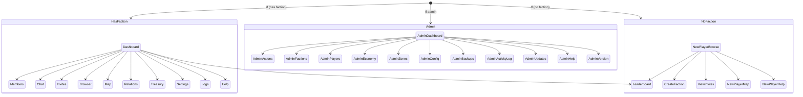

# HyperFactions GUI System

> **Version**: 0.13.0 | **69 page classes** across **3 registries**

Architecture documentation for the HyperFactions GUI system using Hytale's CustomUI.

## Overview

HyperFactions uses Hytale's `InteractiveCustomUIPage<T>` system with:

- **GuiManager** - Central coordinator (page registration + delegation to openers)
- **3 Page Openers** - FactionPageOpener, AdminPageOpener, NewPlayerPageOpener
- **3 Page Registries** - Singleton registries with record-based entries for type-safe navigation
- **UIPaths** - Centralized UI template path constants
- **NavBarUtil + NavEntry** - Shared navigation bar logic
- **Data Models** - Codec-based event data classes for page interactions
- **Shared Components** - Reusable modals and UI elements (Builder pattern)
- **Help System** - Integrated help pages with rich text rendering
- **Real-Time Updates** - ActivePageTracker + GuiUpdateService for live data refresh

## Navigation Flows



## Architecture

```
GuiManager (registration + delegation)
     |
     |--- FactionPageOpener (37 methods)
     |        |--- FactionMainPage / FactionDashboardPage
     |        |--- FactionMembersPage
     |        |--- FactionRelationsPage
     |        |--- FactionSettingsPage
     |        |--- TreasuryPage
     |        |--- FactionChatPage
     |        |--- FactionLeaderboardPage
     |        |--- PlayerInfoPage, FactionInfoPage
     |        '--- ... (24 faction page classes total)
     |
     |--- NewPlayerPageOpener (8 methods)
     |        |--- NewPlayerBrowsePage
     |        |--- CreateFactionPage
     |        |--- InvitesPage
     |        |--- NewPlayerMapPage
     |        '--- HelpPage (5 newplayer page classes)
     |
     |--- AdminPageOpener (41 methods)
     |        |--- AdminMainPage / AdminDashboardPage
     |        |--- AdminFactionsPage
     |        |--- AdminZoneMapPage
     |        |--- AdminConfigPage
     |        '--- ... (30 admin page classes total)
     |
     '--- Shared Components
              |--- UIPaths (centralized template paths)
              |--- NavBarUtil + NavEntry (shared nav logic)
              |--- InputModal (Builder pattern)
              '--- ConfirmationModal (Builder pattern)
```

## Key Classes

| Class | Path | Purpose |
|-------|------|---------|
| GuiManager | [`gui/GuiManager.java`](../src/main/java/com/hyperfactions/gui/GuiManager.java) | Central coordinator (registration + delegation) |
| FactionPageOpener | [`gui/FactionPageOpener.java`](../src/main/java/com/hyperfactions/gui/FactionPageOpener.java) | Faction page opening (37 methods) |
| AdminPageOpener | [`gui/AdminPageOpener.java`](../src/main/java/com/hyperfactions/gui/AdminPageOpener.java) | Admin page opening (41 methods) |
| NewPlayerPageOpener | [`gui/NewPlayerPageOpener.java`](../src/main/java/com/hyperfactions/gui/NewPlayerPageOpener.java) | New player page opening (8 methods) |
| UIPaths | [`gui/UIPaths.java`](../src/main/java/com/hyperfactions/gui/UIPaths.java) | Centralized UI template path constants |
| GuiType | [`gui/GuiType.java`](../src/main/java/com/hyperfactions/gui/GuiType.java) | Page type enumeration (NEW_PLAYER, FACTION_PLAYER, ADMIN) |
| GuiColors | [`gui/GuiColors.java`](../src/main/java/com/hyperfactions/gui/GuiColors.java) | GUI color constants |
| FactionPageRegistry | [`gui/faction/FactionPageRegistry.java`](../src/main/java/com/hyperfactions/gui/faction/FactionPageRegistry.java) | Faction page navigation (singleton, record-based entries) |
| NewPlayerPageRegistry | [`gui/newplayer/NewPlayerPageRegistry.java`](../src/main/java/com/hyperfactions/gui/newplayer/NewPlayerPageRegistry.java) | New player page navigation (singleton, record-based entries) |
| AdminPageRegistry | [`gui/admin/AdminPageRegistry.java`](../src/main/java/com/hyperfactions/gui/admin/AdminPageRegistry.java) | Admin page navigation (singleton, record-based entries) |
| NavBarUtil | [`gui/shared/NavBarUtil.java`](../src/main/java/com/hyperfactions/gui/shared/NavBarUtil.java) | Shared nav bar button builder |
| NavEntry | [`gui/shared/NavEntry.java`](../src/main/java/com/hyperfactions/gui/shared/NavEntry.java) | Navigation entry interface |
| ActivePageTracker | [`gui/ActivePageTracker.java`](../src/main/java/com/hyperfactions/gui/ActivePageTracker.java) | Tracks which pages players have open |
| GuiUpdateService | [`gui/GuiUpdateService.java`](../src/main/java/com/hyperfactions/gui/GuiUpdateService.java) | Bridges manager events to GUI refresh |
| RefreshablePage | [`gui/RefreshablePage.java`](../src/main/java/com/hyperfactions/gui/RefreshablePage.java) | Interface for pages supporting live refresh |

## GuiManager

[`gui/GuiManager.java`](../src/main/java/com/hyperfactions/gui/GuiManager.java)

Central coordinator that handles page registration and delegates page opening to focused opener classes:

```java
public class GuiManager {

    private final Supplier<HyperFactions> plugin;
    private final Supplier<FactionManager> factionManager;
    private final Supplier<ClaimManager> claimManager;
    private final Supplier<PowerManager> powerManager;
    private final Supplier<RelationManager> relationManager;
    private final Supplier<ZoneManager> zoneManager;
    private final Supplier<TeleportManager> teleportManager;
    private final Supplier<InviteManager> inviteManager;
    private final Supplier<JoinRequestManager> joinRequestManager;
    private final Supplier<Path> dataDir;
    // ... other fields

    private final FactionPageOpener factionPageOpener;
    private final AdminPageOpener adminPageOpener;
    private final NewPlayerPageOpener newPlayerPageOpener;

    public GuiManager(Supplier<HyperFactions> plugin,
                      Supplier<FactionManager> factionManager,
                      ... /* all manager suppliers */) {
        // Register pages with all three registries
        registerPages();
        registerNewPlayerPages();
        registerAdminPages();

        // Initialize page opener delegates
        this.factionPageOpener = new FactionPageOpener(this);
        this.adminPageOpener = new AdminPageOpener(this);
        this.newPlayerPageOpener = new NewPlayerPageOpener(this);
    }

    // All openXxx() methods delegate to the appropriate opener
    public void openFactionMain(Player player, Ref<EntityStore> ref,
                                Store<EntityStore> store, PlayerRef playerRef) {
        factionPageOpener.openFactionMain(player, ref, store, playerRef);
    }

    public void openAdminMain(Player player, Ref<EntityStore> ref,
                              Store<EntityStore> store, PlayerRef playerRef) {
        adminPageOpener.openAdminMain(player, ref, store, playerRef);
    }
}
```

## Page Flows

### Faction Member Flow

For players who belong to a faction:

```
FactionDashboardPage (dashboard, or FactionMainPage if no faction)
     |
     |--- FactionChatPage
     |
     |--- FactionMembersPage
     |        '--- PlayerInfoPage
     |             |--- TransferConfirmPage
     |             |--- LeaveConfirmPage / LeaderLeaveConfirmPage
     |             '--- FactionInfoPage (target player's faction)
     |
     |--- FactionInvitesPage (officers+)
     |
     |--- FactionBrowserPage
     |        '--- FactionInfoPage (other faction)
     |
     |--- ChunkMapPage
     |
     |--- FactionLeaderboardPage
     |
     |--- FactionRelationsPage
     |        '--- SetRelationModalPage
     |
     |--- TreasuryPage (if economy enabled)
     |        |--- TreasuryDepositModalPage
     |        |--- TreasuryTransferSearchPage
     |        |    '--- TreasuryTransferConfirmPage
     |        '--- TreasurySettingsPage
     |
     |--- FactionSettingsPage
     |        |--- RenameModalPage
     |        |--- DescriptionModalPage
     |        |--- TagModalPage
     |        '--- DisbandConfirmPage
     |
     |--- FactionModulesPage
     |
     |--- LogsViewerPage
     |
     |--- HelpMainPage
     |
     '--- PlayerSettingsPage
```

### New Player Flow

For players without a faction:

```
NewPlayerBrowsePage (default landing page)
     |
     |--- CreateFactionPage
     |
     |--- InvitesPage
     |        '--- Accept invite -> joins faction
     |
     |--- NewPlayerMapPage (read-only territory view)
     |
     |--- FactionLeaderboardPage
     |
     |--- HelpMainPage
     |
     '--- PlayerSettingsPage
```

### Admin Flow

For players with admin permission:

```
AdminDashboardPage (stats)
     |
     |--- AdminActionsPage
     |
     |--- AdminFactionsPage
     |        |--- AdminFactionInfoPage
     |        |--- AdminFactionMembersPage
     |        |--- AdminFactionRelationsPage
     |        |--- AdminFactionSettingsPage
     |        |--- AdminDisbandConfirmPage
     |        '--- AdminUnclaimAllConfirmPage
     |
     |--- AdminPlayersPage
     |        '--- AdminPlayerInfoPage
     |
     |--- AdminEconomyPage (if economy enabled)
     |        |--- AdminEconomyAdjustPage
     |        '--- AdminBulkEconomyPage
     |
     |--- AdminZonePage
     |        |--- AdminZoneMapPage
     |        |--- AdminZoneSettingsPage
     |        |    '--- AdminZoneIntegrationFlagsPage
     |        |--- AdminZonePropertiesPage
     |        |--- CreateZoneWizardPage
     |        |--- ZoneRenameModalPage
     |        '--- ZoneChangeTypeModalPage
     |
     |--- AdminConfigPage
     |        '--- ScalingTiersModalPage
     |
     |--- AdminBackupsPage
     |
     |--- AdminActivityLogPage
     |
     |--- AdminUpdatesPage
     |
     |--- AdminHelpPage
     |
     '--- AdminVersionPage
```

## Page Registry Pattern

Each flow uses a singleton registry with record-based entries for type-safe navigation. Entries are registered in `GuiManager`'s constructor via `registerPages()`, `registerNewPlayerPages()`, and `registerAdminPages()`.

### FactionPageRegistry

[`gui/faction/FactionPageRegistry.java`](../src/main/java/com/hyperfactions/gui/faction/FactionPageRegistry.java)

```java
public final class FactionPageRegistry {

    private static final FactionPageRegistry INSTANCE = new FactionPageRegistry();

    public static FactionPageRegistry getInstance() { return INSTANCE; }

    /**
     * Each entry is a record (not an enum) with runtime registration.
     */
    public record Entry(
        @NotNull String id,              // e.g., "dashboard", "members"
        @NotNull String displayName,     // UI display name
        @Nullable String permission,     // Required permission node (null = no check)
        @NotNull PageSupplier guiSupplier,
        boolean showsInNavBar,
        boolean requiresFaction,
        @Nullable FactionRole minimumRole, // Minimum faction role (null = no role check)
        int order                         // Display order (lower = first)
    ) implements NavEntry, Comparable<Entry> { }

    @FunctionalInterface
    public interface PageSupplier {
        @Nullable InteractiveCustomUIPage<?> create(
            Player player, Ref<EntityStore> ref, Store<EntityStore> store,
            PlayerRef playerRef, @Nullable Faction faction, GuiManager guiManager
        );
    }

    public void registerEntry(@NotNull Entry entry) { ... }
    public @Nullable Entry getEntry(@NotNull String id) { ... }
    public @NotNull List<Entry> getEntries() { ... }
    public @NotNull List<Entry> getNavBarEntries() { ... }
    public @NotNull List<Entry> getAccessibleEntries(@NotNull PlayerRef playerRef, @Nullable Faction faction) { ... }
    public @NotNull List<Entry> getAccessibleNavBarEntries(@NotNull PlayerRef playerRef, @Nullable Faction faction) { ... }
}
```

**Registered entries** (in GuiManager.registerPages()):

| ID | Nav Bar | Requires Faction | Order |
|----|---------|------------------|-------|
| `dashboard` | Yes | No | 0 |
| `chat` | Yes | Yes | 1 |
| `members` | Yes | Yes | 2 |
| `invites` | Yes | Yes (Officer+) | 3 |
| `browser` | Yes | No | 4 |
| `map` | Yes | No | 5 |
| `leaderboard` | Yes | No | 6 |
| `relations` | Yes | Yes | 7 |
| `treasury` | Yes | Yes (if economy enabled) | 8 |
| `settings` | Yes | Yes | 9 |
| `logs` | Yes | Yes | 10 |
| `help` | Yes | No | 11 |
| `player_settings` | No (far right) | No | 99 |
| `admin` | No | No | 13 |

### AdminPageRegistry

[`gui/admin/AdminPageRegistry.java`](../src/main/java/com/hyperfactions/gui/admin/AdminPageRegistry.java)

Same singleton + record pattern. Entry record has fields: `id`, `displayName`, `permission`, `guiSupplier`, `showsInNavBar`, `order` (no `requiresFaction` or `minimumRole`).

**Registered entries** (in GuiManager.registerAdminPages()):

| ID | Nav Bar | Order |
|----|---------|-------|
| `dashboard` | Yes | 0 |
| `actions` | Yes | 1 |
| `factions` | Yes | 2 |
| `players` | Yes | 3 |
| `economy` | Yes (if enabled) | 4 |
| `zones` | Yes | 5 |
| `config` | Yes | 6 |
| `backups` | Yes | 7 |
| `log` | Yes | 8 |
| `updates` | Yes | 9 |
| `help` | Yes | 10 |
| `version` | Yes | 11 |

### NewPlayerPageRegistry

[`gui/newplayer/NewPlayerPageRegistry.java`](../src/main/java/com/hyperfactions/gui/newplayer/NewPlayerPageRegistry.java)

Same singleton + record pattern. Entry record has fields: `id`, `displayName`, `permission`, `guiSupplier`, `showsInNavBar`, `order`.

**Registered entries** (in GuiManager.registerNewPlayerPages()):

| ID | Nav Bar | Order |
|----|---------|-------|
| `browse` | Yes | 0 |
| `create` | Yes | 1 |
| `invites` | Yes | 2 |
| `map` | Yes | 3 |
| `leaderboard` | Yes | 4 |
| `help` | Yes | 5 |
| `player_settings` | No (far right) | 99 |

## Page Implementation

### Base Pattern

Each page extends `InteractiveCustomUIPage<T>` where `T` is a codec-based event data class. Pages override `build()` to render UI and `handleDataEvent()` to process interactions:

```java
public class FactionMainPage extends InteractiveCustomUIPage<FactionPageData> {

    private final PlayerRef playerRef;
    private final FactionManager factionManager;
    private final ClaimManager claimManager;
    private final PowerManager powerManager;
    private final TeleportManager teleportManager;
    private final InviteManager inviteManager;
    private final GuiManager guiManager;

    public FactionMainPage(PlayerRef playerRef,
                           FactionManager factionManager,
                           ClaimManager claimManager, ...) {
        super(playerRef, CustomPageLifetime.CanDismiss, FactionPageData.CODEC);
        // ... assign fields
    }

    @Override
    public void build(Ref<EntityStore> ref, UICommandBuilder cmd,
                      UIEventBuilder events, Store<EntityStore> store) {
        // Append UI templates via cmd.append(UIPaths.FACTION_MAIN)
        // Set text/properties via cmd.set("#ElementId.Property", value)
        // Bind events via events.addEventBinding(...)
        NavBarHelper.setupBar(playerRef, faction, PAGE_ID, cmd, events);
    }

    @Override
    public void handleDataEvent(Ref<EntityStore> ref, Store<EntityStore> store,
                                FactionPageData data) {
        super.handleDataEvent(ref, store, data);
        // Handle nav bar events
        if (NavBarHelper.handleNavEvent(data, player, ref, store, playerRef, faction, guiManager)) {
            return;
        }
        // Handle page-specific button clicks
        switch (data.button) {
            case "CreateFaction" -> guiManager.openCreateFaction(player, ref, store, playerRef);
            case "Home" -> handleHomeTeleport(...);
            case "Leave" -> handleLeave(...);
            // ...
        }
    }
}
```

### Event Data Classes

Pages use codec-based event data classes (not display records). These hold the event payload from button clicks:

```java
// gui/faction/data/FactionMainData.java
public class FactionMainData {
    public String button;       // The button/action that triggered the event
    public String factionId;    // Target faction ID (if any)

    public static final BuilderCodec<FactionMainData> CODEC = BuilderCodec
        .builder(FactionMainData.class, FactionMainData::new)
        .addField(new KeyedCodec<>("Button", Codec.STRING),
                  (data, value) -> data.button = value, data -> data.button)
        .addField(new KeyedCodec<>("FactionId", Codec.STRING),
                  (data, value) -> data.factionId = value, data -> data.factionId)
        .build();
}
```

Many pages share `FactionPageData` as a common event data class with fields like `button`, `factionId`, `playerId`, etc.

## Shared Components

### InputModal

[`gui/shared/component/InputModal.java`](../src/main/java/com/hyperfactions/gui/shared/component/InputModal.java)

Generic text input modal using a Builder pattern. Renders into an existing page via `render()`:

```java
public class InputModal {

    // Use the builder to create
    public static Builder builder() { ... }

    public static class Builder {
        public Builder title(@NotNull String title) { ... }
        public Builder label(@NotNull String label) { ... }
        public Builder placeholder(@NotNull String placeholder) { ... }
        public Builder currentValue(@Nullable String currentValue) { ... }
        public Builder maxLength(int maxLength) { ... }
        public Builder multiline(boolean multiline) { ... }
        public Builder submitEvent(@NotNull String eventName) { ... }
        public Builder submitEvent(@NotNull String eventName, @NotNull EventData data) { ... }
        public Builder cancelEvent(@NotNull String eventName) { ... }
        public InputModal build() { ... }
    }

    // Renders into the page's UI tree
    public void render(@NotNull UICommandBuilder cmd, @NotNull UIEventBuilder events,
                       @NotNull String targetId) { ... }

    // Quick helpers
    public static InputModal rename(String currentName) { ... }
    public static InputModal description(String currentDescription) { ... }
    public static InputModal playerName() { ... }
}
```

### ConfirmationModal

[`gui/shared/component/ConfirmationModal.java`](../src/main/java/com/hyperfactions/gui/shared/component/ConfirmationModal.java)

Yes/No confirmation dialog using a Builder pattern. Renders into an existing page via `render()`:

```java
public class ConfirmationModal {

    public static Builder builder() { ... }

    public static class Builder {
        public Builder title(@NotNull String title) { ... }
        public Builder message(@NotNull String message) { ... }
        public Builder confirmEvent(@NotNull String eventName) { ... }
        public Builder confirmEvent(@NotNull String eventName, @NotNull EventData data) { ... }
        public Builder cancelEvent(@NotNull String eventName) { ... }
        public ConfirmationModal build() { ... }
    }

    public void render(@NotNull UICommandBuilder cmd, @NotNull UIEventBuilder events,
                       @NotNull String targetId) { ... }

    // Quick helpers
    public static ConfirmationModal dangerous(String title, String message, String confirmEvent) { ... }
    public static ConfirmationModal safe(String title, String message, String confirmEvent) { ... }
}
```

## Navigation Pattern

### Forward Navigation

Navigation goes through `GuiManager`, which delegates to the appropriate page opener:

```java
// From any page's handleDataEvent
switch (data.button) {
    case "Members" -> guiManager.openFactionMembers(player, ref, store, playerRef, faction);
    case "Settings" -> guiManager.openFactionSettings(player, ref, store, playerRef, faction);
    case "BrowseFactions" -> guiManager.openFactionBrowser(player, ref, store, playerRef);
}
```

### Nav Bar Navigation

Nav bar events are handled by helper classes:

```java
// In handleDataEvent
if (NavBarHelper.handleNavEvent(data, player, ref, store, playerRef, faction, guiManager)) {
    return; // Nav bar handled it
}
```

### Close / Back Navigation

```java
// Close current page
guiManager.closePage(player, ref, store);
```

### Modal Flow

Modals are separate page classes that navigate back to the parent page on completion:

```java
// Open rename modal (navigates to RenameModalPage)
guiManager.openRenameModal(player, ref, store, playerRef, faction);

// In RenameModalPage.handleDataEvent, after rename succeeds:
guiManager.openFactionSettings(player, ref, store, playerRef, faction);
```

## Page Directory Structure

```
gui/
|-- GuiManager.java               # Central coordinator (registration + delegation)
|-- FactionPageOpener.java        # Faction page opening methods (37 methods)
|-- AdminPageOpener.java          # Admin page opening methods (41 methods)
|-- NewPlayerPageOpener.java      # New player page opening methods (8 methods)
|-- UIPaths.java                  # Centralized UI template path constants
|-- GuiType.java                  # Page type enum (NEW_PLAYER, FACTION_PLAYER, ADMIN)
|-- GuiColors.java                # GUI color constants
|-- ActivePageTracker.java        # Live data refresh tracking
|-- RefreshablePage.java          # Refreshable page interface
|-- GuiUpdateService.java         # GUI update coordination
|
|-- faction/                      # Faction member pages
|   |-- FactionPageRegistry.java  # Navigation registry (singleton, record entries)
|   |-- NavBarHelper.java         # Faction navigation bar
|   |-- ChunkMapAsset.java        # Chunk map asset generation
|   |-- page/                     # Page implementations (24 classes)
|   |   |-- FactionMainPage.java
|   |   |-- FactionDashboardPage.java
|   |   |-- FactionMembersPage.java
|   |   |-- FactionRelationsPage.java
|   |   |-- FactionSettingsPage.java
|   |   |-- FactionBrowserPage.java
|   |   |-- FactionHelpPage.java
|   |   |-- FactionInvitesPage.java
|   |   |-- FactionModulesPage.java
|   |   |-- FactionChatPage.java
|   |   |-- FactionLeaderboardPage.java
|   |   |-- ChunkMapPage.java
|   |   |-- LogsViewerPage.java
|   |   |-- PlayerInfoPage.java
|   |   |-- TreasuryPage.java
|   |   |-- TreasuryDepositModalPage.java
|   |   |-- TreasurySettingsPage.java
|   |   |-- TreasuryTransferSearchPage.java
|   |   |-- TreasuryTransferConfirmPage.java
|   |   |-- SetRelationModalPage.java
|   |   |-- DisbandConfirmPage.java
|   |   |-- LeaveConfirmPage.java
|   |   |-- LeaderLeaveConfirmPage.java
|   |   '-- TransferConfirmPage.java
|   '-- data/                     # Event data classes (21 classes)
|       |-- FactionPageData.java  # Shared event data (button, factionId, playerId, ...)
|       |-- FactionMainData.java
|       |-- FactionDashboardData.java
|       |-- FactionMembersData.java
|       |-- FactionRelationsData.java
|       |-- FactionSettingsData.java
|       |-- FactionBrowserData.java
|       |-- FactionChatData.java
|       |-- FactionModulesData.java
|       |-- ChunkMapData.java
|       |-- LogsViewerData.java
|       |-- PlayerInfoData.java
|       |-- TreasuryData.java
|       |-- TreasurySettingsData.java
|       |-- TreasuryTransferConfirmData.java
|       |-- DepositModalData.java
|       |-- TransferSearchData.java
|       |-- SetRelationModalData.java
|       |-- TransferConfirmData.java
|       |-- LeaveConfirmData.java
|       '-- LeaderLeaveConfirmData.java
|
|-- admin/                        # Admin pages (registry + pages + data)
|   |-- AdminPageRegistry.java    # Admin navigation registry (singleton, record entries)
|   |-- AdminNavBarHelper.java    # Admin navigation bar
|   |-- ConfigSnapshot.java       # Config editing session state
|   |-- ConfigValidator.java      # Config input validation
|   |-- page/                     # Admin page implementations (30 classes)
|   |   |-- AdminMainPage.java
|   |   |-- AdminDashboardPage.java
|   |   |-- AdminActionsPage.java
|   |   |-- AdminFactionsPage.java
|   |   |-- AdminFactionInfoPage.java
|   |   |-- AdminFactionMembersPage.java
|   |   |-- AdminFactionRelationsPage.java
|   |   |-- AdminFactionSettingsPage.java
|   |   |-- AdminPlayersPage.java
|   |   |-- AdminPlayerInfoPage.java
|   |   |-- AdminEconomyPage.java
|   |   |-- AdminEconomyAdjustPage.java
|   |   |-- AdminBulkEconomyPage.java
|   |   |-- AdminZonePage.java
|   |   |-- AdminZoneMapPage.java
|   |   |-- AdminZoneSettingsPage.java
|   |   |-- AdminZoneIntegrationFlagsPage.java
|   |   |-- AdminZonePropertiesPage.java
|   |   |-- CreateZoneWizardPage.java
|   |   |-- ZoneRenameModalPage.java
|   |   |-- ZoneChangeTypeModalPage.java
|   |   |-- AdminConfigPage.java
|   |   |-- ScalingTiersModalPage.java
|   |   |-- AdminBackupsPage.java
|   |   |-- AdminActivityLogPage.java
|   |   |-- AdminUpdatesPage.java
|   |   |-- AdminVersionPage.java
|   |   |-- AdminHelpPage.java
|   |   |-- AdminDisbandConfirmPage.java
|   |   '-- AdminUnclaimAllConfirmPage.java
|   '-- data/                     # Admin data classes (29 classes)
|       |-- AdminMainData.java
|       |-- AdminDashboardData.java
|       |-- AdminNavAwareData.java
|       |-- AdminActionsData.java
|       |-- AdminFactionsData.java
|       |-- AdminFactionInfoData.java
|       |-- AdminFactionMembersData.java
|       |-- AdminFactionRelationsData.java
|       |-- AdminFactionSettingsData.java
|       |-- AdminPlayersData.java
|       |-- AdminPlayerInfoData.java
|       |-- AdminEconomyData.java
|       |-- AdminEconomyAdjustData.java
|       |-- AdminBulkEconomyData.java
|       |-- AdminZoneData.java
|       |-- AdminZoneMapData.java
|       |-- AdminZoneSettingsData.java
|       |-- AdminZonePropertiesData.java
|       |-- ZoneRenameModalData.java
|       |-- ZoneChangeTypeModalData.java
|       |-- AdminConfigData.java
|       |-- ScalingTiersData.java
|       |-- AdminBackupsData.java
|       |-- AdminActivityLogData.java
|       |-- AdminUpdatesData.java
|       |-- AdminVersionData.java
|       |-- AdminHelpData.java
|       |-- AdminDisbandConfirmData.java
|       '-- AdminUnclaimAllConfirmData.java
|
|-- newplayer/                    # New player flow (registry + pages + data)
|   |-- NewPlayerPageRegistry.java   # New player navigation (singleton, record entries)
|   |-- NewPlayerNavBarHelper.java   # New player navigation bar
|   |-- page/                     # New player page implementations (5 classes)
|   |   |-- NewPlayerBrowsePage.java
|   |   |-- CreateFactionPage.java
|   |   |-- InvitesPage.java
|   |   |-- NewPlayerMapPage.java
|   |   '-- HelpPage.java
|   '-- data/                     # New player data models
|       '-- NewPlayerPageData.java
|
|-- shared/                       # Shared components
|   |-- NavEntry.java             # Navigation entry interface
|   |-- NavBarUtil.java           # Shared nav bar button builder
|   |-- component/
|   |   |-- InputModal.java       # Text input modal (Builder pattern)
|   |   '-- ConfirmationModal.java # Yes/No confirmation (Builder pattern)
|   |-- page/                     # Shared page implementations (7 classes)
|   |   |-- MainMenuPage.java
|   |   |-- FactionInfoPage.java
|   |   |-- PlayerSettingsPage.java
|   |   |-- PlaceholderPage.java
|   |   |-- RenameModalPage.java
|   |   |-- DescriptionModalPage.java
|   |   '-- TagModalPage.java
|   '-- data/                     # Shared data models (9 classes)
|       |-- NavAwareData.java
|       |-- MainMenuData.java
|       |-- CreateFactionData.java
|       |-- PlayerSettingsData.java
|       |-- PlaceholderData.java
|       |-- RenameModalData.java
|       |-- DescriptionModalData.java
|       |-- DisbandConfirmData.java
|       '-- TagModalData.java
|
|-- help/                         # Help system
|   |-- HelpCategory.java        # Help category enum
|   |-- HelpTopic.java           # Help topic record (id, titleKey, entries, commands, category)
|   |-- HelpEntry.java           # Typed content entry record (type, messageKey, color)
|   |-- HelpRegistry.java        # Help content registry
|   |-- HelpMessages.java        # Key-based i18n string store (delegates to HFMessages)
|   |-- HelpRichText.java        # Inline markdown parser (**bold**, `command`, *italic*)
|   |-- data/
|   |   '-- HelpPageData.java
|   '-- page/
|       '-- HelpMainPage.java
|
'-- test/                         # Test pages
    |-- ButtonTestPage.java
    '-- MarkdownTestPage.java
```

## Permission Checks in GUI

Pages check permissions through the registry entry's `permission` field (checked during navigation) and through explicit checks in `handleDataEvent`:

```java
public class FactionSettingsPage extends InteractiveCustomUIPage<FactionSettingsData> {

    @Override
    public void handleDataEvent(Ref<EntityStore> ref, Store<EntityStore> store,
                                FactionSettingsData data) {
        super.handleDataEvent(ref, store, data);

        Player player = store.getComponent(ref, Player.getComponentType());
        PlayerRef playerRef = store.getComponent(ref, PlayerRef.getComponentType());

        switch (data.button) {
            case "Disband" -> {
                // Check if player is leader
                FactionMember member = faction.getMember(playerRef.getUuid());
                if (member != null && member.role() == FactionRole.LEADER) {
                    guiManager.openDisbandConfirm(player, ref, store, playerRef, faction);
                }
            }
            // ...
        }
    }
}
```

## New Pages in v0.10.0

### Admin Pages

#### AdminActionsPage
Global admin quick actions: K/D reset (per-player and server-wide), bulk operations. Accessible from admin nav bar.

#### AdminActivityLogPage
Server-wide faction activity browser. Aggregates logs across all factions with filters for log type, player name, and time range (1h/24h/7d/all). Paginated with expandable entries showing actor, target, and details.

#### AdminEconomyPage
Server economy overview with sortable faction balance list. Shows total server economy, average balance, and per-faction treasury details. Links to AdminEconomyAdjustPage for individual adjustments.

#### AdminEconomyAdjustPage
Per-faction treasury adjustment modal. Supports set, add, and remove operations with admin audit logging. Opened from AdminEconomyPage.

#### AdminBulkEconomyPage
Bulk economy operations page for batch treasury adjustments across multiple factions.

#### AdminVersionPage
Displays mod version, server version, build info, and integration status for all 12 supported mods (HyperPerms, LuckPerms, VaultUnlocked, Ecotale, PAPI, WiFlow, OrbisGuard, HyperProtect-Mixin, OG-Mixins, Gravestones, HyBounty, MultipleHUD). Green/red status indicators.

#### AdminZonePropertiesPage
Consolidated zone property editor. Edit zone name, type (SafeZone/WarZone), and notification settings (entry/leave title suppression, custom text) in a single page. Opened from AdminZonePage.

### Faction Pages

#### FactionLeaderboardPage
Sortable faction leaderboard with 5 sort modes: K/D (default), Power, Territory, Balance, Members. 10 entries per page with pagination. Top 3 get gold/silver/bronze rank colors. Own faction row highlighted. Accessible from nav bar and `/f leaderboard`.

#### TreasuryPage
Faction treasury management hub. Shows balance, recent transactions, and autopay status. Links to deposit, withdrawal, transfer, and settings sub-pages. Requires economy integration (Ecotale/VaultUnlocked).

#### TreasuryDepositModalPage
Deposit modal with amount input and confirmation. Validates against player balance. Shows current treasury and player balance.

#### TreasurySettingsPage
Treasury autopay and access settings. Configure auto-deposit percentage, withdrawal permissions per role, and transfer limits.

#### TreasuryTransferSearchPage
Inter-faction transfer search. Browse and search target factions for treasury transfers. Shows faction names with balance preview.

#### TreasuryTransferConfirmPage
Transfer confirmation modal. Shows source faction, target faction, amount, and fee (if configured). Requires officer+ permission.

## New Pages in v0.13.0

### Admin Pages

#### AdminConfigPage
Runtime config editor with 11 tabs: Server, Chat, Announcements, Economy, Factions, Faction Perms, Worldmap, Worlds, Backup, Debug, Gravestones. Size-adaptive layouts (narrow/standard/wide), inline editing with boolean toggles, integer/double steppers, text fields, color pickers, enum dropdowns, and locale selectors. Edit session caching survives page close/reopen. Per-field validation with error highlighting. Uses ConfigSnapshot for applying changes and ConfigValidator for input bounds.

#### AdminBackupsPage
Paginated backup list with expand/collapse detail view per entry. Create manual backups with optional custom name. Restore with two-click confirmation and automatic safety backup. Delete with two-click confirmation. Backup type filter dropdown (All / Hourly / Daily / Weekly / Manual / Migration).

#### AdminUpdatesPage
Two-column layout: HyperFactions (left) and HyperProtect Mixin (right). Shows current version, latest version, channel, build date, and update status. Single "Check for Updates" button checks both simultaneously. Download buttons appear when updates are available. Changelog display for HyperFactions updates. Rollback support with two-click confirmation.

#### ScalingTiersModalPage
Upkeep scaling tiers editor modal opened from AdminConfigPage Economy tab. Add/remove/reorder tiers with promote/demote buttons (disabled on first/last). Live cost example display.

## Adding New Pages

1. **Create event data class** in appropriate `data/` package:
   ```java
   public class NewFeatureData {
       public String button;
       // ... other event fields

       public static final BuilderCodec<NewFeatureData> CODEC = BuilderCodec
           .builder(NewFeatureData.class, NewFeatureData::new)
           .addField(new KeyedCodec<>("Button", Codec.STRING),
                     (data, value) -> data.button = value, data -> data.button)
           .build();
   }
   ```

2. **Create page class** in appropriate `page/` package:
   ```java
   public class NewFeaturePage extends InteractiveCustomUIPage<NewFeatureData> {

       public NewFeaturePage(PlayerRef playerRef, ...) {
           super(playerRef, CustomPageLifetime.CanDismiss, NewFeatureData.CODEC);
       }

       @Override
       public void build(Ref<EntityStore> ref, UICommandBuilder cmd,
                         UIEventBuilder events, Store<EntityStore> store) {
           cmd.append(UIPaths.NEW_FEATURE);
           NavBarHelper.setupBar(playerRef, faction, "new_feature", cmd, events);
           // ... render UI
       }

       @Override
       public void handleDataEvent(Ref<EntityStore> ref, Store<EntityStore> store,
                                   NewFeatureData data) {
           super.handleDataEvent(ref, store, data);
           // ... handle events
       }
   }
   ```

3. **Register in GuiManager** within `registerPages()`:
   ```java
   registry.registerEntry(new Entry(
       "new_feature",
       GuiKeys.Nav.NEW_FEATURE,
       null, // permission
       (player, ref, store, playerRef, faction, guiManager) ->
           new NewFeaturePage(playerRef, ...),
       true, // showsInNavBar
       true, // requiresFaction
       12   // order
   ));
   ```

4. **Add opener method** in the appropriate PageOpener class:
   ```java
   // In FactionPageOpener
   public void openNewFeature(Player player, Ref<EntityStore> ref,
                              Store<EntityStore> store, PlayerRef playerRef,
                              Faction faction) {
       PageManager pageManager = player.getPageManager();
       NewFeaturePage page = new NewFeaturePage(playerRef, ...);
       pageManager.openCustomPage(ref, store, page);
   }
   ```

5. **Add delegation** in GuiManager:
   ```java
   public void openNewFeature(Player player, Ref<EntityStore> ref,
                              Store<EntityStore> store, PlayerRef playerRef,
                              Faction faction) {
       factionPageOpener.openNewFeature(player, ref, store, playerRef, faction);
   }
   ```

## Code Links

| Class | Path |
|-------|------|
| GuiColors | [`gui/GuiColors.java`](../src/main/java/com/hyperfactions/gui/GuiColors.java) |
| GuiManager | [`gui/GuiManager.java`](../src/main/java/com/hyperfactions/gui/GuiManager.java) |
| FactionPageOpener | [`gui/FactionPageOpener.java`](../src/main/java/com/hyperfactions/gui/FactionPageOpener.java) |
| AdminPageOpener | [`gui/AdminPageOpener.java`](../src/main/java/com/hyperfactions/gui/AdminPageOpener.java) |
| NewPlayerPageOpener | [`gui/NewPlayerPageOpener.java`](../src/main/java/com/hyperfactions/gui/NewPlayerPageOpener.java) |
| UIPaths | [`gui/UIPaths.java`](../src/main/java/com/hyperfactions/gui/UIPaths.java) |
| GuiType | [`gui/GuiType.java`](../src/main/java/com/hyperfactions/gui/GuiType.java) |
| ActivePageTracker | [`gui/ActivePageTracker.java`](../src/main/java/com/hyperfactions/gui/ActivePageTracker.java) |
| RefreshablePage | [`gui/RefreshablePage.java`](../src/main/java/com/hyperfactions/gui/RefreshablePage.java) |
| GuiUpdateService | [`gui/GuiUpdateService.java`](../src/main/java/com/hyperfactions/gui/GuiUpdateService.java) |
| FactionPageRegistry | [`gui/faction/FactionPageRegistry.java`](../src/main/java/com/hyperfactions/gui/faction/FactionPageRegistry.java) |
| NavBarHelper | [`gui/faction/NavBarHelper.java`](../src/main/java/com/hyperfactions/gui/faction/NavBarHelper.java) |
| ChunkMapAsset | [`gui/faction/ChunkMapAsset.java`](../src/main/java/com/hyperfactions/gui/faction/ChunkMapAsset.java) |
| NewPlayerPageRegistry | [`gui/newplayer/NewPlayerPageRegistry.java`](../src/main/java/com/hyperfactions/gui/newplayer/NewPlayerPageRegistry.java) |
| NewPlayerNavBarHelper | [`gui/newplayer/NewPlayerNavBarHelper.java`](../src/main/java/com/hyperfactions/gui/newplayer/NewPlayerNavBarHelper.java) |
| AdminPageRegistry | [`gui/admin/AdminPageRegistry.java`](../src/main/java/com/hyperfactions/gui/admin/AdminPageRegistry.java) |
| AdminNavBarHelper | [`gui/admin/AdminNavBarHelper.java`](../src/main/java/com/hyperfactions/gui/admin/AdminNavBarHelper.java) |
| ConfigSnapshot | [`gui/admin/ConfigSnapshot.java`](../src/main/java/com/hyperfactions/gui/admin/ConfigSnapshot.java) |
| ConfigValidator | [`gui/admin/ConfigValidator.java`](../src/main/java/com/hyperfactions/gui/admin/ConfigValidator.java) |
| NavBarUtil | [`gui/shared/NavBarUtil.java`](../src/main/java/com/hyperfactions/gui/shared/NavBarUtil.java) |
| NavEntry | [`gui/shared/NavEntry.java`](../src/main/java/com/hyperfactions/gui/shared/NavEntry.java) |
| InputModal | [`gui/shared/component/InputModal.java`](../src/main/java/com/hyperfactions/gui/shared/component/InputModal.java) |
| ConfirmationModal | [`gui/shared/component/ConfirmationModal.java`](../src/main/java/com/hyperfactions/gui/shared/component/ConfirmationModal.java) |
| HelpCategory | [`gui/help/HelpCategory.java`](../src/main/java/com/hyperfactions/gui/help/HelpCategory.java) |
| HelpTopic | [`gui/help/HelpTopic.java`](../src/main/java/com/hyperfactions/gui/help/HelpTopic.java) |
| HelpEntry | [`gui/help/HelpEntry.java`](../src/main/java/com/hyperfactions/gui/help/HelpEntry.java) |
| HelpRegistry | [`gui/help/HelpRegistry.java`](../src/main/java/com/hyperfactions/gui/help/HelpRegistry.java) |
| HelpMessages | [`gui/help/HelpMessages.java`](../src/main/java/com/hyperfactions/gui/help/HelpMessages.java) |
| HelpRichText | [`gui/help/HelpRichText.java`](../src/main/java/com/hyperfactions/gui/help/HelpRichText.java) |
