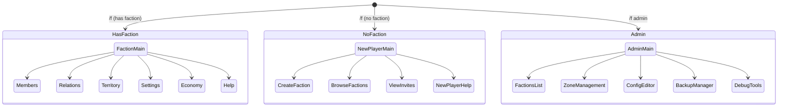

# HyperFactions GUI System

> **Version**: 0.7.0 | **40+ pages** across **3 registries**

Architecture documentation for the HyperFactions GUI system using Hytale's CustomUI.

## Overview

HyperFactions uses Hytale's `InteractiveCustomUIPage` system with:

- **GuiManager** (~2,000 lines) - Central coordinator for opening pages
- **3 Page Registries** - Type-safe navigation between pages
- **Data Models** - Records for page state
- **Shared Components** - Reusable modals and UI elements
- **Help System** - Integrated help pages
- **Real-Time Updates** - ActivePageTracker for live data refresh

## Navigation Flows



## Architecture

```
GuiManager
     │
     ├─► Faction Pages (FactionPageRegistry)
     │        ├─► FactionMainPage (dashboard)
     │        ├─► FactionMembersPage
     │        ├─► FactionRelationsPage
     │        ├─► FactionSettingsPage
     │        ├─► FactionEconomyPage
     │        └─► ... (15+ pages)
     │
     ├─► New Player Pages (NewPlayerPageRegistry)
     │        ├─► CreateFactionStep1Page
     │        ├─► InvitesPage
     │        ├─► BrowseFactionsPage
     │        ├─► HelpPage
     │        └─► ... (5+ pages)
     │
     ├─► Admin Pages (AdminPageRegistry)
     │        ├─► AdminMainPage
     │        ├─► AdminZoneMapPage
     │        ├─► AdminFactionsPage
     │        └─► ... (12+ pages)
     │
     └─► Shared Components
              ├─► InputModal
              ├─► ColorPickerModal
              └─► ConfirmationModal
```

## Key Classes

| Class | Path | Purpose |
|-------|------|---------|
| GuiManager | [`gui/GuiManager.java`](../src/main/java/com/hyperfactions/gui/GuiManager.java) | Central GUI coordinator |
| GuiType | [`gui/GuiType.java`](../src/main/java/com/hyperfactions/gui/GuiType.java) | Page type enumeration |
| FactionPageRegistry | [`gui/faction/FactionPageRegistry.java`](../src/main/java/com/hyperfactions/gui/faction/FactionPageRegistry.java) | Faction page navigation |
| NewPlayerPageRegistry | [`gui/newplayer/NewPlayerPageRegistry.java`](../src/main/java/com/hyperfactions/gui/newplayer/NewPlayerPageRegistry.java) | New player page navigation |
| AdminPageRegistry | [`gui/admin/AdminPageRegistry.java`](../src/main/java/com/hyperfactions/gui/admin/AdminPageRegistry.java) | Admin page navigation |

## GuiManager

[`gui/GuiManager.java`](../src/main/java/com/hyperfactions/gui/GuiManager.java)

Central coordinator that decides which page flow to use:

```java
public class GuiManager {

    private final Supplier<HyperFactions> plugin;
    private final Supplier<FactionManager> factionManager;
    // ... other manager suppliers

    public void openFactionMain(Player player, Ref<EntityStore> ref,
                                Store<EntityStore> store, PlayerRef playerRef) {
        UUID playerUuid = playerRef.getUuid();
        Faction faction = factionManager.get().getPlayerFaction(playerUuid);

        if (faction != null) {
            // Player has faction - show faction dashboard
            openFactionPage(player, ref, store, playerRef, FactionPageRegistry.Entry.MAIN);
        } else {
            // No faction - show new player menu
            openNewPlayerPage(player, ref, store, playerRef, NewPlayerPageRegistry.Entry.MAIN);
        }
    }

    public void openAdminMain(Player player, Ref<EntityStore> ref,
                              Store<EntityStore> store, PlayerRef playerRef) {
        openAdminPage(player, ref, store, playerRef, AdminPageRegistry.Entry.MAIN);
    }
}
```

## Page Flows

### Faction Member Flow

For players who belong to a faction:

```
FactionMainPage (dashboard)
     │
     ├─► FactionMembersPage
     │        └─► PlayerInfoPage
     │             └─► TransferConfirmPage / LeaveConfirmPage
     │
     ├─► FactionRelationsPage
     │        └─► SetRelationModalPage
     │
     ├─► FactionSettingsPage
     │        ├─► RenameModalPage
     │        ├─► DescriptionModalPage
     │        ├─► TagModalPage
     │        └─► ColorPickerPage
     │
     ├─► ChunkMapPage
     │
     ├─► FactionBrowserPage
     │        └─► FactionInfoPage (other faction)
     │
     ├─► LogsViewerPage
     │
     └─► FactionHelpPage
```

### New Player Flow

For players without a faction:

```
MainMenuPage
     │
     ├─► CreateFactionStep1Page
     │        └─► CreateFactionStep2Page
     │
     ├─► InvitesPage
     │        └─► Accept invite → joins faction
     │
     ├─► NewPlayerBrowsePage
     │        └─► Request to join
     │
     ├─► NewPlayerMapPage
     │
     └─► HelpPage
```

### Admin Flow

For players with admin permission:

```
AdminMainPage
     │
     ├─► AdminDashboardPage (stats)
     │
     ├─► AdminFactionsPage
     │        ├─► AdminFactionInfoPage
     │        ├─► AdminFactionMembersPage
     │        ├─► AdminFactionRelationsPage
     │        ├─► AdminFactionSettingsPage
     │        └─► AdminDisbandConfirmPage
     │
     ├─► AdminZoneMapPage
     │        ├─► CreateZoneWizardPage
     │        └─► AdminZoneSettingsPage
     │                 └─► AdminZoneIntegrationFlagsPage
     │
     ├─► AdminConfigPage
     │
     ├─► AdminBackupsPage
     │
     ├─► AdminUpdatesPage
     │
     └─► AdminHelpPage
```

## Page Registry Pattern

Each flow uses a registry for type-safe navigation:

### FactionPageRegistry

[`gui/faction/FactionPageRegistry.java`](../src/main/java/com/hyperfactions/gui/faction/FactionPageRegistry.java)

```java
public class FactionPageRegistry {

    public enum Entry {
        MAIN,
        MEMBERS,
        RELATIONS,
        SETTINGS,
        MAP,
        BROWSER,
        LOGS,
        HELP,
        // ... modals
        PLAYER_INFO,
        RENAME_MODAL,
        COLOR_PICKER,
        DISBAND_CONFIRM,
        LEAVE_CONFIRM,
        TRANSFER_CONFIRM
    }

    public static void openPage(
            Entry entry,
            Player player,
            Ref<EntityStore> ref,
            Store<EntityStore> store,
            PlayerRef playerRef,
            Object... args) {

        InteractiveCustomUIPage page = createPage(entry, player, ref, store, playerRef, args);
        PageManager pageManager = player.getPageManager();
        pageManager.openPage(page);
    }

    private static InteractiveCustomUIPage createPage(Entry entry, ...) {
        return switch (entry) {
            case MAIN -> new FactionMainPage(playerRef, ref, store);
            case MEMBERS -> new FactionMembersPage(playerRef, ref, store);
            case RELATIONS -> new FactionRelationsPage(playerRef, ref, store);
            // ...
        };
    }
}
```

## Page Implementation

### Base Pattern

Each page extends `InteractiveCustomUIPage`:

```java
public class FactionMainPage extends InteractiveCustomUIPage {

    private final PlayerRef playerRef;
    private final Ref<EntityStore> ref;
    private final Store<EntityStore> store;

    public FactionMainPage(PlayerRef playerRef, Ref<EntityStore> ref, Store<EntityStore> store) {
        super("hyperfactions:faction_main"); // UI definition ID
        this.playerRef = playerRef;
        this.ref = ref;
        this.store = store;
    }

    @Override
    public void init(Data data) {
        // Populate initial page data
        FactionMainData pageData = buildData();
        data.set(pageData);
    }

    @Override
    public void handleEvent(String event, Data data) {
        // Handle button clicks
        switch (event) {
            case "members_clicked" -> navigateToMembers();
            case "relations_clicked" -> navigateToRelations();
            case "claim_clicked" -> performClaim();
            // ...
        }
    }

    private void navigateToMembers() {
        FactionPageRegistry.openPage(Entry.MEMBERS, player, ref, store, playerRef);
    }
}
```

### Data Records

Pages use records for their data models:

```java
// gui/faction/data/FactionMainData.java
public record FactionMainData(
    String factionName,
    String factionTag,
    String factionColor,
    int memberCount,
    int maxMembers,
    int claimCount,
    int maxClaims,
    double factionPower,
    double maxPower,
    boolean isLeader,
    boolean isOfficer,
    List<MemberEntry> onlineMembers
) {
    public record MemberEntry(
        String username,
        String role,
        boolean online
    ) {}
}
```

## Shared Components

### InputModal

[`gui/shared/component/InputModal.java`](../src/main/java/com/hyperfactions/gui/shared/component/InputModal.java)

Generic text input modal:

```java
public class InputModal {

    public static void show(
            Player player,
            String title,
            String placeholder,
            String currentValue,
            Consumer<String> onSubmit,
            Runnable onCancel) {

        // Open modal with callback handlers
    }
}
```

### ColorPickerModal

[`gui/shared/component/ColorPickerModal.java`](../src/main/java/com/hyperfactions/gui/shared/component/ColorPickerModal.java)

Color selection grid:

```java
public class ColorPickerModal {

    // 16 Minecraft color codes (0-9, a-f)
    private static final String[] COLORS = {
        "0", "1", "2", "3", "4", "5", "6", "7",
        "8", "9", "a", "b", "c", "d", "e", "f"
    };

    public static void show(
            Player player,
            String currentColor,
            Consumer<String> onSelect) {
        // Open color grid modal
    }
}
```

### ConfirmationModal

[`gui/shared/component/ConfirmationModal.java`](../src/main/java/com/hyperfactions/gui/shared/component/ConfirmationModal.java)

Yes/No confirmation dialog:

```java
public class ConfirmationModal {

    public static void show(
            Player player,
            String title,
            String message,
            String confirmText,
            String cancelText,
            Runnable onConfirm,
            Runnable onCancel) {
        // Open confirmation dialog
    }
}
```

## Navigation Pattern

### Forward Navigation

```java
// From FactionMainPage
private void onMembersClicked() {
    FactionPageRegistry.openPage(
        Entry.MEMBERS,
        player, ref, store, playerRef
    );
}
```

### Navigation with Arguments

```java
// Open player info for specific player
private void onMemberClicked(UUID targetUuid) {
    FactionPageRegistry.openPage(
        Entry.PLAYER_INFO,
        player, ref, store, playerRef,
        targetUuid // Additional argument
    );
}
```

### Back Navigation

```java
// Close current page (returns to previous)
private void onBackClicked() {
    player.getPageManager().closePage();
}
```

### Modal Flow

```java
// Show rename modal, then return to settings
private void onRenameClicked() {
    InputModal.show(
        player,
        "Rename Faction",
        "New name",
        currentName,
        newName -> {
            // Process rename
            factionManager.renameFaction(factionId, newName);
            // Refresh settings page
            FactionPageRegistry.openPage(Entry.SETTINGS, ...);
        },
        () -> {
            // Cancelled - stay on current page
        }
    );
}
```

## Page Directory Structure

```
gui/
├── GuiManager.java               # Central coordinator
├── GuiType.java                  # Page type enum
├── ActivePageTracker.java        # Live data refresh tracking
├── RefreshablePage.java          # Refreshable page interface
├── GuiUpdateService.java         # GUI update coordination
│
├── faction/                      # Faction member pages
│   ├── FactionPageRegistry.java  # Navigation registry
│   ├── NavBarHelper.java         # Faction navigation bar
│   ├── ChunkMapAsset.java        # Chunk map asset
│   ├── page/                     # Page implementations
│   │   ├── FactionMainPage.java
│   │   ├── FactionMembersPage.java
│   │   ├── FactionRelationsPage.java
│   │   ├── FactionSettingsPage.java
│   │   ├── FactionBrowserPage.java
│   │   ├── FactionDashboardPage.java
│   │   ├── FactionHelpPage.java
│   │   ├── FactionInvitesPage.java
│   │   ├── FactionModulesPage.java
│   │   ├── FactionChatPage.java
│   │   ├── LogsViewerPage.java
│   │   ├── PlayerInfoPage.java
│   │   ├── SetRelationModalPage.java
│   │   ├── DisbandConfirmPage.java
│   │   ├── LeaveConfirmPage.java
│   │   ├── LeaderLeaveConfirmPage.java
│   │   └── TransferConfirmPage.java
│   └── data/                     # Data records
│       ├── FactionMainData.java
│       ├── FactionMembersData.java
│       ├── FactionRelationsData.java
│       └── ...
│
├── admin/                       # Admin pages (registry + pages + data)
│   ├── AdminPageRegistry.java
│   ├── AdminNavBarHelper.java
│   ├── page/                    # Admin page implementations
│   │   ├── AdminMainPage.java
│   │   ├── AdminDashboardPage.java
│   │   ├── AdminFactionsPage.java
│   │   ├── AdminFactionInfoPage.java
│   │   ├── AdminFactionMembersPage.java
│   │   ├── AdminFactionRelationsPage.java
│   │   ├── AdminFactionSettingsPage.java
│   │   ├── AdminPlayersPage.java
│   │   ├── AdminPlayerInfoPage.java
│   │   ├── AdminZoneMapPage.java
│   │   ├── AdminZonePage.java
│   │   ├── AdminZoneSettingsPage.java
│   │   ├── AdminZoneIntegrationFlagsPage.java
│   │   ├── CreateZoneWizardPage.java
│   │   ├── ZoneRenameModalPage.java
│   │   ├── ZoneChangeTypeModalPage.java
│   │   ├── AdminConfigPage.java
│   │   ├── AdminBackupsPage.java
│   │   ├── AdminUpdatesPage.java
│   │   ├── AdminHelpPage.java
│   │   ├── AdminDisbandConfirmPage.java
│   │   └── AdminUnclaimAllConfirmPage.java
│   └── data/                    # Admin data records
│       ├── AdminMainData.java
│       ├── AdminDashboardData.java
│       └── ...
│
├── newplayer/                   # New player flow (registry + pages + data)
│   ├── NewPlayerPageRegistry.java  # New player navigation
│   ├── NewPlayerNavBarHelper.java  # New player navigation bar
│   ├── page/                    # New player page implementations
│   │   ├── CreateFactionPage.java
│   │   ├── InvitesPage.java
│   │   ├── HelpPage.java
│   │   ├── NewPlayerMapPage.java
│   │   └── NewPlayerBrowsePage.java
│   └── data/                    # New player data models
│       └── NewPlayerPageData.java
│
├── shared/                      # Shared components
│   ├── component/
│   │   ├── InputModal.java
│   │   └── ConfirmationModal.java
│   ├── page/
│   │   ├── MainMenuPage.java
│   │   ├── FactionInfoPage.java
│   │   ├── PlaceholderPage.java
│   │   ├── RenameModalPage.java
│   │   ├── DescriptionModalPage.java
│   │   └── TagModalPage.java
│   └── data/
│       ├── NavAwareData.java
│       ├── MainMenuData.java
│       └── ...
│
├── help/                        # Help system
│   ├── HelpCategory.java
│   ├── HelpTopic.java
│   ├── HelpRegistry.java
│   ├── data/
│   │   └── HelpPageData.java
│   └── page/
│       └── HelpMainPage.java
│
└── test/                        # Test pages
    └── ButtonTestPage.java
```

## Permission Checks in GUI

Pages check permissions before sensitive operations:

```java
public class FactionSettingsPage extends InteractiveCustomUIPage {

    @Override
    public void handleEvent(String event, Data data) {
        if (event.equals("disband_clicked")) {
            // Check if player is leader
            if (!isLeader(playerRef.getUuid())) {
                showError("Only the faction leader can disband.");
                return;
            }

            // Check permission
            if (!hasPermission(playerRef.getUuid(), Permissions.DISBAND)) {
                showError("You don't have permission to disband.");
                return;
            }

            // Show confirmation
            FactionPageRegistry.openPage(Entry.DISBAND_CONFIRM, ...);
        }
    }
}
```

## Adding New Pages

1. **Create data record** in appropriate `data/` package:
   ```java
   public record NewFeatureData(
       String title,
       List<ItemEntry> items
   ) {}
   ```

2. **Create page class** in appropriate `page/` package:
   ```java
   public class NewFeaturePage extends InteractiveCustomUIPage {
       // Implementation
   }
   ```

3. **Add to registry** enum and switch:
   ```java
   // In FactionPageRegistry
   public enum Entry {
       // ...
       NEW_FEATURE
   }

   private static InteractiveCustomUIPage createPage(Entry entry, ...) {
       return switch (entry) {
           // ...
           case NEW_FEATURE -> new NewFeaturePage(playerRef, ref, store);
       };
   }
   ```

4. **Add navigation** from existing pages:
   ```java
   private void onNewFeatureClicked() {
       FactionPageRegistry.openPage(Entry.NEW_FEATURE, ...);
   }
   ```

## Code Links

| Class | Path |
|-------|------|
| GuiManager | [`gui/GuiManager.java`](../src/main/java/com/hyperfactions/gui/GuiManager.java) |
| FactionPageRegistry | [`gui/faction/FactionPageRegistry.java`](../src/main/java/com/hyperfactions/gui/faction/FactionPageRegistry.java) |
| NewPlayerPageRegistry | [`gui/newplayer/NewPlayerPageRegistry.java`](../src/main/java/com/hyperfactions/gui/newplayer/NewPlayerPageRegistry.java) |
| NewPlayerNavBarHelper | [`gui/newplayer/NewPlayerNavBarHelper.java`](../src/main/java/com/hyperfactions/gui/newplayer/NewPlayerNavBarHelper.java) |
| AdminPageRegistry | [`gui/admin/AdminPageRegistry.java`](../src/main/java/com/hyperfactions/gui/admin/AdminPageRegistry.java) |
| NavBarHelper | [`gui/faction/NavBarHelper.java`](../src/main/java/com/hyperfactions/gui/faction/NavBarHelper.java) |
| InputModal | [`gui/shared/component/InputModal.java`](../src/main/java/com/hyperfactions/gui/shared/component/InputModal.java) |
