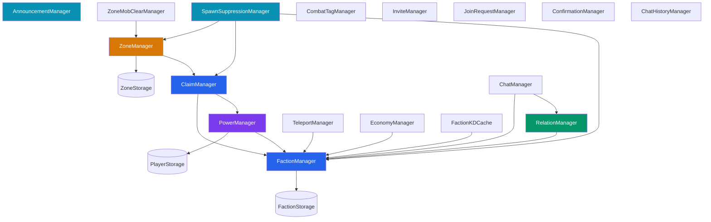

# HyperFactions Manager Layer

> **Version**: 0.13.0 | **17 manager classes** in `manager/` package

The manager layer contains all business logic for HyperFactions, organized by domain.

## Overview

Managers are initialized in [`HyperFactions.java`](../src/main/java/com/hyperfactions/HyperFactions.java) with explicit dependency injection. `HyperFactions.java` acts as an orchestrator, delegating lifecycle responsibilities to the `lifecycle/` package:

- **`lifecycle/CallbackWiring`** - Wires all manager callbacks: GUI updates, events, announcements, explosion/harvest/hammer protection hooks, economy, world map, map player filter, overclaim notification
- **`lifecycle/PeriodicTaskManager`** - Periodic task management (power regen, combat tag decay, invite cleanup)
- **`lifecycle/MembershipHistoryHandler`** - Member join/leave history tracking

Each manager:

- Owns a specific domain of functionality
- Performs permission checks before operations
- Returns typed result enums (not boolean/exception)
- Uses async storage via `CompletableFuture`



## Manager Index

| Manager | Responsibility | Dependencies |
|---------|----------------|--------------|
| [FactionManager](#factionmanager) | Faction CRUD, membership, roles | FactionStorage |
| [ClaimManager](#claimmanager) | Territory claiming/unclaiming | FactionManager, PowerManager (+ ZoneManager injected post-construction) |
| [PowerManager](#powermanager) | Player power, regen, penalties | PlayerStorage, FactionManager |
| [RelationManager](#relationmanager) | Diplomatic relations | FactionManager |
| [ZoneManager](#zonemanager) | SafeZone/WarZone management | ZoneStorage, ClaimManager |
| [CombatTagManager](#combattagmanager) | Combat tagging, spawn protection | None |
| [TeleportManager](#teleportmanager) | Faction home teleportation | FactionManager |
| [InviteManager](#invitemanager) | Faction invites with expiration | dataDir (Path) |
| [JoinRequestManager](#joinrequestmanager) | Join requests for closed factions | dataDir (Path) |
| [ChatManager](#chatmanager) | Faction/ally chat channels | FactionManager, RelationManager, playerLookup |
| [ConfirmationManager](#confirmationmanager) | Text-mode confirmations | None |
| [EconomyManager](#economymanager) | Faction economy (treasury, transactions) | FactionManager, VaultEconomyProvider, JsonEconomyStorage |
| [AnnouncementManager](#announcementmanager) | Server-wide event broadcasts | onlinePlayersSupplier |
| [SpawnSuppressionManager](#spawnsuppressionmanager) | Mob spawn control in claims/zones | ZoneManager, ClaimManager, FactionManager |
| [ChatHistoryManager](#chathistorymanager) | Faction chat history persistence | ChatHistoryStorage |
| [ZoneMobClearManager](#zonemobclearmanager) | Periodic mob clearing in zones | ZoneManager, HyperFactions |
| [FactionKDCache](#factionkdcache) | Leaderboard K/D statistics cache | FactionManager, PlayerStorage |

## Initialization Order

Order matters due to dependencies:

```java
// 1. Core managers (order matters for dependency injection)
factionManager = new FactionManager(factionStorage);
powerManager = new PowerManager(playerStorage, factionManager);
claimManager = new ClaimManager(factionManager, powerManager);
relationManager = new RelationManager(factionManager);
combatTagManager = new CombatTagManager();
zoneManager = new ZoneManager(zoneStorage, claimManager);
claimManager.setZoneManager(zoneManager); // Post-construction injection

// 2. Spawn/mob managers (depend on multiple managers)
spawnSuppressionManager = new SpawnSuppressionManager(zoneManager, claimManager, factionManager);
zoneMobClearManager = new ZoneMobClearManager(zoneManager, hyperFactions);
teleportManager = new TeleportManager(factionManager);

// 3. Standalone persistence managers
inviteManager = new InviteManager(dataPath);
joinRequestManager = new JoinRequestManager(dataPath);
confirmationManager = new ConfirmationManager();

// 4. Data loading phase
factionManager.loadAll().join();
powerManager.loadAll().join();
zoneManager.loadAll().join();
claimManager.buildIndex();

// 5. Economy (conditional — requires config enabled + VaultUnlocked)
economyManager = new EconomyManager(factionManager, vaultEconomyProvider, economyStorage);

// 6. Leaderboard K/D cache
factionKDCache = new FactionKDCache(factionManager, playerStorage);

// 7. Announcement manager (deferred online players supplier)
announcementManager = new AnnouncementManager(onlinePlayersSupplier);

// 8. Chat managers (deferred player lookup)
chatManager = new ChatManager(factionManager, relationManager, playerLookup);
chatHistoryManager = new ChatHistoryManager(chatHistoryStorage);
chatManager.setChatHistoryManager(chatHistoryManager);
```

---

## FactionManager

[`manager/FactionManager.java`](../src/main/java/com/hyperfactions/manager/FactionManager.java)

Core faction lifecycle and membership management.

### Responsibilities

- Create/disband factions
- Add/remove/kick members
- Promote/demote members
- Transfer leadership
- Update faction properties (name, description, tag, color)
- Track member last online timestamps
- Manage faction permissions (territory flags)

### Key Methods

| Method | Permission | Returns |
|--------|------------|---------|
| `createFaction(name, leaderUuid, leaderName)` | `faction.create` | `FactionResult` |
| `disbandFaction(factionId, actorUuid)` | `faction.disband` | `FactionResult` |
| `addMember(factionId, playerUuid, playerName)` | - | `FactionResult` |
| `removeMember(factionId, playerUuid, actorUuid, isKick)` | - | `FactionResult` |
| `promoteMember(factionId, playerUuid, actorUuid)` | `member.promote` | `FactionResult` |
| `demoteMember(factionId, playerUuid, actorUuid)` | `member.demote` | `FactionResult` |
| `transferLeadership(factionId, newLeader, actorUuid)` | `member.transfer` | `FactionResult` |
| `setHome(factionId, home, actorUuid)` | `teleport.sethome` | `FactionResult` |

### Result Enum

```java
public enum FactionResult {
    SUCCESS,
    ALREADY_IN_FACTION,
    NOT_IN_FACTION,
    FACTION_NOT_FOUND,
    NAME_TAKEN,
    NAME_TOO_SHORT,
    NAME_TOO_LONG,
    FACTION_FULL,
    NOT_LEADER,
    NOT_OFFICER,
    CANNOT_KICK_LEADER,
    CANNOT_DEMOTE_MEMBER,
    CANNOT_PROMOTE_LEADER,
    TARGET_NOT_IN_FACTION,
    NO_PERMISSION
}
```

### Data Access

```java
// Get faction by ID (returns @Nullable Faction)
Faction faction = factionManager.getFaction(factionId);

// Get player's faction
UUID factionId = factionManager.getPlayerFactionId(playerUuid);  // @Nullable UUID
Faction faction = factionManager.getPlayerFaction(playerUuid);    // @Nullable Faction

// Check same faction
boolean same = factionManager.areInSameFaction(player1, player2);

// Get all factions
Collection<Faction> all = factionManager.getAllFactions();
```

---

## ClaimManager

[`manager/ClaimManager.java`](../src/main/java/com/hyperfactions/manager/ClaimManager.java)

Territory claiming and chunk ownership tracking.

### Responsibilities

- Claim/unclaim chunks for factions
- Overclaim (take territory from weaker factions)
- Track chunk ownership via spatial index
- Validate claim constraints (adjacency, world whitelist/blacklist)
- Calculate claim limits based on faction power

### Key Methods

| Method | Permission | Returns |
|--------|------------|---------|
| `claim(playerUuid, world, chunkX, chunkZ)` | `territory.claim` | `ClaimResult` |
| `unclaim(playerUuid, world, chunkX, chunkZ)` | `territory.unclaim` | `ClaimResult` |
| `overclaim(playerUuid, world, chunkX, chunkZ)` | `territory.overclaim` | `ClaimResult` |
| `getClaimOwner(world, chunkX, chunkZ)` | - | `UUID` (factionId, nullable) |
| `getTotalClaimCount()` | - | `int` |
| `countFactionClaimsInWorld(factionId, world)` | - | `int` |
| `getFactionClaims(factionId)` | - | `Set<ChunkKey>` |

### Result Enum

```java
public enum ClaimResult {
    SUCCESS,
    NO_PERMISSION,
    NOT_IN_FACTION,
    NOT_OFFICER,
    ALREADY_CLAIMED_SELF,
    ALREADY_CLAIMED_OTHER,
    ALREADY_CLAIMED_ALLY,
    ALREADY_CLAIMED_ENEMY,
    NOT_ADJACENT,
    MAX_CLAIMS_REACHED,
    WORLD_MAX_CLAIMS_REACHED,
    INSUFFICIENT_POWER,
    WORLD_NOT_ALLOWED,
    CHUNK_NOT_CLAIMED,
    CANNOT_UNCLAIM_HOME,
    NOT_YOUR_CLAIM,
    OVERCLAIM_NOT_ALLOWED,
    TARGET_HAS_POWER,
    ORBISGUARD_PROTECTED,
    ZONE_PROTECTED,
    WOULD_DISCONNECT
}
```

`WORLD_MAX_CLAIMS_REACHED` is returned when the faction has hit the per-world claim cap configured in `worlds.json` (the `maxClaims` setting). This is checked in both the `claim()` and `overclaim()` flows using the `countFactionClaimsInWorld()` helper, which counts existing claims for a faction in a specific world.

### Debounce

Claim and unclaim operations have a 500ms per-player debounce to prevent double-execution from rapid command dispatch or key-down/key-up events.

### Claim Index

Claims are indexed by `ChunkKey` (world + chunk coordinates) for O(1) lookups:

```java
private final Map<ChunkKey, UUID> claimIndex = new ConcurrentHashMap<>();

public UUID getClaimOwner(String world, int chunkX, int chunkZ) {
    return claimIndex.get(new ChunkKey(world, chunkX, chunkZ));
}
```

---

## PowerManager

[`manager/PowerManager.java`](../src/main/java/com/hyperfactions/manager/PowerManager.java)

Player power mechanics that limit territory claiming.

### Responsibilities

- Track individual player power levels
- Apply death penalties
- Apply combat logout penalties
- Regenerate power over time
- Calculate faction total power
- Load/save player power data

### Key Methods

| Method | Purpose | Returns |
|--------|---------|---------|
| `getPlayerPower(playerUuid)` | Get full power record | `PlayerPower` (record with `power`, `maxPower`, etc.) |
| `applyDeathPenalty(playerUuid)` | Reduce power on death | `double` (amount lost) |
| `applyCombatLogoutPenalty(playerUuid, penalty)` | Reduce power on combat log | `double` (amount lost) |
| `tickPowerRegen()` | Called periodically to regenerate power | `void` |
| `getFactionPower(factionId)` | Sum of all member power | `double` |
| `getFactionPowerStats(factionId)` | Detailed power stats | `FactionPowerStats` |
| `playerOnline(playerUuid)` | Mark player as online | `void` |
| `playerOffline(playerUuid)` | Mark player as offline | `void` |

### Power Formula

```
Faction Max Claims = min(
    floor(totalFactionPower / powerPerClaim),
    configMaxClaims
)
```

Where:
- `totalFactionPower` = sum of all online member power (+ offline if configured)
- `powerPerClaim` = config value (default: 2.0)
- `configMaxClaims` = hard cap from config (default: 100)

---

## RelationManager

[`manager/RelationManager.java`](../src/main/java/com/hyperfactions/manager/RelationManager.java)

Diplomatic relations between factions.

### Responsibilities

- Track ally/enemy/neutral relations
- Handle ally requests (two-way handshake)
- Enforce relation limits (max allies, max enemies)
- Provide relation lookups for protection/chat

### Key Methods

| Method | Permission | Returns |
|--------|------------|---------|
| `requestAlly(playerUuid, targetFactionId)` | `relation.ally` | `RelationResult` |
| `acceptAlly(playerUuid, requesterFactionId)` | `relation.ally` | `RelationResult` |
| `setEnemy(playerUuid, targetFactionId)` | `relation.enemy` | `RelationResult` |
| `setNeutral(playerUuid, targetFactionId)` | `relation.neutral` | `RelationResult` |
| `getRelation(factionId1, factionId2)` | - | `RelationType` |
| `getEffectiveRelation(factionId1, factionId2)` | - | `RelationType` |
| `getPlayerRelation(player1, player2)` | - | `RelationType` |

### Relation Types

```java
public enum RelationType {
    OWN,      // Same faction
    ALLY,     // Allied factions
    NEUTRAL,  // Default state
    ENEMY     // Declared enemies
}
```

### Bidirectional Relations

`getRelation()` returns the one-way declared relation (A→B). `getEffectiveRelation()` checks both directions and returns the effective relation:

- **ENEMY** wins if either side declares enemy
- **ALLY** only if both sides are allies
- Otherwise **NEUTRAL**

Used by map player filtering and `/f info` to show the true relationship state.

### Ally Handshake

Ally relationships require mutual agreement:

1. Faction A requests ally with Faction B
2. Request is stored as pending
3. Faction B accepts the request
4. Both factions marked as allies

---

## ZoneManager

[`manager/ZoneManager.java`](../src/main/java/com/hyperfactions/manager/ZoneManager.java)

Admin-controlled SafeZones and WarZones.

### Responsibilities

- Create/delete zones
- Claim/unclaim chunks for zones
- Manage zone flags (PvP, build, interact, etc.)
- Priority over faction claims (zones override)
- Persist zone data

### Key Methods

| Method | Purpose |
|--------|---------|
| `createZone(name, type, creatorUuid)` | Create new zone |
| `removeZone(zoneId)` | Remove zone and release chunks |
| `claimChunk(zoneId, world, chunkX, chunkZ)` | Add chunk to zone |
| `unclaimChunk(zoneId, world, chunkX, chunkZ)` | Remove chunk from zone |
| `getZone(world, chunkX, chunkZ)` | Get zone at location |
| `isInSafeZone(world, chunkX, chunkZ)` | Check if SafeZone |
| `isInWarZone(world, chunkX, chunkZ)` | Check if WarZone |
| `setZoneFlag(zoneId, flagName, value)` | Set zone flag |
| `changeZoneType(zoneId, resetFlags)` | Toggle zone type |

### Zone Flags

Defined in [`data/ZoneFlags.java`](../src/main/java/com/hyperfactions/data/ZoneFlags.java) — **52 boolean flags** across 10 categories, plus 1 string setting (`map_visibility`).

Many flags require OrbisGuard-Mixins to function (marked with *mixin*).

| Category | Flags | Count |
|----------|-------|-------|
| **Combat** | `pvp_enabled`, `friendly_fire`, `friendly_fire_faction`, `friendly_fire_ally`, `projectile_damage`, `mob_damage`, `pve_damage` | 7 |
| **Damage** | `fall_damage`, `environmental_damage`, `explosion_damage` *mixin*, `fire_spread` *mixin* | 4 |
| **Death** | `keep_inventory` *mixin*, `power_loss` | 2 |
| **Building** | `build_allowed`, `block_place` *mixin*, `hammer_use` *mixin*, `builder_tools_use` *mixin* | 4 |
| **Interaction** | `block_interact`, `door_use`, `container_use`, `bench_use`, `processing_use`, `seat_use`, `mount_use` *mixin*, `light_use`, `npc_use`, `npc_tame` *mixin*, `npc_interact`, `crate_pickup` *mixin*, `crate_place` *mixin* | 13 |
| **Transport** | `teleporter_use` *mixin*, `portal_use` *mixin*, `mount_entry` | 3 |
| **Items** | `item_drop`, `item_pickup`, `item_pickup_manual` *mixin*, `invincible_items` *mixin* | 4 |
| **Spawning** | `mob_spawning`, `hostile_mob_spawning`, `passive_mob_spawning`, `neutral_mob_spawning`, `npc_spawning` *mixin* | 5 |
| **Mob Clearing** | `mob_clear`, `hostile_mob_clear`, `passive_mob_clear`, `neutral_mob_clear` | 4 |
| **Integration** | `gravestone_access`, `show_on_map`, `essentials_homes`, `essentials_warps`, `essentials_kits`, `essentials_back` | 6 |

Flags support parent-child hierarchies (e.g., `pvp_enabled` > `friendly_fire` > `friendly_fire_faction`/`friendly_fire_ally`). Child flags only take effect when their parent is enabled.

**Key SafeZone defaults**: PvP off, building off, all damage off, keep inventory on, mob spawning off, hostile mob clearing on, doors/seats/block interaction/NPC shops allowed.

**Key WarZone defaults**: Full PvP on, building off (anti-grief), all damage on, no keep inventory, full mob spawning on, no mob clearing.

---

## CombatTagManager

[`manager/CombatTagManager.java`](../src/main/java/com/hyperfactions/manager/CombatTagManager.java)

Combat tagging, spawn protection, and damage type tracking.

### Responsibilities

- Tag players when they enter combat
- Track tag expiration
- Detect combat logout
- Manage spawn protection (respawn invincibility)
- Call logout penalty callback
- Track last damage type per player (for configurable power loss by death cause)

### DeathCauseType Enum

Categorizes damage source for power loss configuration:

| Value | Description |
|-------|-------------|
| `PVP` | Killed by another player (direct or projectile) |
| `MOB` | Killed by a mob (direct or mob projectile) |
| `ENVIRONMENTAL` | Fall damage, drowning, suffocation, or other non-entity damage |
| `UNKNOWN` | Death cause could not be determined |

### Key Methods

| Method | Purpose |
|--------|---------|
| `tagCombat(attacker, defender)` | Tag both players in combat |
| `tagPlayer(playerUuid)` | Tag a single player |
| `isTagged(playerUuid)` | Check if combat tagged |
| `getRemainingSeconds(playerUuid)` | Get tag time left |
| `handleDisconnect(playerUuid)` | Process disconnect (returns wasTagged) |
| `applySpawnProtection(playerUuid, durationSeconds, world, chunkX, chunkZ)` | Grant respawn protection |
| `hasSpawnProtection(playerUuid)` | Check if spawn protected |
| `clearSpawnProtection(playerUuid)` | Remove spawn protection |
| `tickDecay()` | Called every second to expire tags |
| `recordDamageType(playerUuid, type)` | Record last damage cause type |
| `getLastDamageType(playerUuid)` | Get last damage type (or UNKNOWN) |
| `clearDamageType(playerUuid)` | Clear recorded damage type |
| `getLastAttacker(defenderUuid)` | Get and consume last attacker UUID |

### Combat Tag Flow

```
Player A attacks Player B
     │
     ▼
tagPlayers(A, B)
     │
     ├─► Both tagged for tagDurationSeconds
     │
     ▼
If player disconnects while tagged:
     │
     ▼
handleDisconnect() returns true
     │
     ▼
onCombatLogout callback invoked
     │
     ▼
Power penalty applied via PowerManager
```

---

## TeleportManager

[`manager/TeleportManager.java`](../src/main/java/com/hyperfactions/manager/TeleportManager.java)

Faction home teleportation with warmup/cooldown.

### Responsibilities

- Track pending teleports
- Manage warmup timers
- Enforce cooldowns
- Cancel on movement or damage (if configured)
- Execute teleport via platform callback

### Key Methods

| Method | Permission | Returns |
|--------|------------|---------|
| `teleportToHome(playerUuid, startLocation, doTeleport, sendMessage, isTagged)` | `teleport.home` | `TeleportResult` |
| `scheduleTeleport(playerUuid, startLocation, destination, warmupSeconds, isTagged)` | - | `void` |
| `checkMovement(playerUuid, currentX, currentY, currentZ, sendMessage)` | - | `boolean` |
| `cancelOnDamage(playerUuid, sendMessage)` | - | `boolean` |
| `removePending(playerUuid)` | - | `void` |
| `isOnCooldown(playerUuid)` | - | `boolean` |
| `getCooldownRemaining(playerUuid)` | - | `int` (seconds) |

### Result Enum

```java
public enum TeleportResult {
    SUCCESS_INSTANT,     // Teleport completed immediately (no warmup)
    SUCCESS_WARMUP,      // Warmup scheduled, teleport pending
    NO_PERMISSION,
    NO_HOME,
    NOT_IN_FACTION,
    ON_COOLDOWN,
    COMBAT_TAGGED,
    CANCELLED_MOVED,
    CANCELLED_DAMAGE,
    CANCELLED_MANUAL,
    WORLD_NOT_FOUND
}
```

---

## InviteManager

[`manager/InviteManager.java`](../src/main/java/com/hyperfactions/manager/InviteManager.java)

Faction invites with expiration.

### Responsibilities

- Create invites with expiration timestamps
- Track pending invites per player
- Validate and accept invites
- Clean up expired invites
- Persist invites to survive restarts

### Key Methods

| Method | Permission | Returns |
|--------|------------|---------|
| `createInviteChecked(factionId, playerUuid, invitedBy)` | `member.invite` | `CreateInviteResult` |
| `createInvite(factionId, playerUuid, invitedBy)` | - | `PendingInvite` |
| `getPlayerInvites(playerUuid)` | - | `Set<PendingInvite>` |
| `cleanupExpired()` | - | Called periodically |

---

## JoinRequestManager

[`manager/JoinRequestManager.java`](../src/main/java/com/hyperfactions/manager/JoinRequestManager.java)

Join requests for closed factions.

### Responsibilities

- Create join requests with optional messages
- Track requests per faction
- Allow officers to accept/deny
- Clean up expired requests
- Persist requests to survive restarts

### Key Methods

| Method | Permission | Returns |
|--------|------------|---------|
| `createRequestChecked(factionId, playerUuid, playerName, message)` | `member.join` | `CreateRequestResult` |
| `acceptRequest(factionId, playerUuid)` | - | `JoinRequest` (nullable) |
| `getFactionRequests(factionId)` | - | `List<JoinRequest>` |

---

## ChatManager

[`manager/ChatManager.java`](../src/main/java/com/hyperfactions/manager/ChatManager.java)

Faction and ally chat channels.

### Responsibilities

- Track player chat channel state
- Route messages to faction/ally channels
- Format chat messages with faction info
- Provide relation colors for public chat

### Key Methods

| Method | Permission | Returns |
|--------|------------|---------|
| `toggleFactionChatChecked(playerUuid)` | `chat.faction` | `ToggleResult` |
| `toggleAllyChatChecked(playerUuid)` | `chat.ally` | `ToggleResult` |
| `cycleChannelChecked(playerUuid)` | `chat.faction`/`chat.ally` | `ToggleResult` |
| `processChatMessage(sender, message)` | - | `boolean` (was handled) |
| `resetChannel(playerUuid)` | - | `void` |

### Chat Channels

```java
public enum ChatChannel {
    NORMAL,   // Normal server chat
    FACTION,  // Only faction members see
    ALLY      // Faction + allied factions see
}
```

---

## ConfirmationManager

[`manager/ConfirmationManager.java`](../src/main/java/com/hyperfactions/manager/ConfirmationManager.java)

Text-mode command confirmations for destructive actions.

### Responsibilities

- Store pending confirmations with expiration
- Validate confirmation codes
- Execute confirmed actions

### Usage Pattern

```java
// In command: check or create confirmation
ConfirmationResult result = confirmationManager.checkOrCreate(
    playerUuid, ConfirmationType.DISBAND, null
);

switch (result) {
    case NEEDS_CONFIRMATION -> sendMessage("Run command again to confirm");
    case CONFIRMED -> doDisband();           // Second invocation confirms
    case EXPIRED_RECREATED -> sendMessage("Previous expired, run again");
    case DIFFERENT_ACTION -> sendMessage("Replaced previous action, run again");
}
```

### Types

```java
public enum ConfirmationType {
    DISBAND, LEAVE, TRANSFER, RESTORE_BACKUP
}

public enum ConfirmationResult {
    NEEDS_CONFIRMATION, CONFIRMED, DIFFERENT_ACTION, EXPIRED_RECREATED
}
```

---

## EconomyManager

[`manager/EconomyManager.java`](../src/main/java/com/hyperfactions/manager/EconomyManager.java)

Faction treasury management implementing the `EconomyAPI` interface.

### Responsibilities

- Manage faction balance (deposit, withdraw, transfer)
- Record transaction history with limit enforcement
- Currency formatting and naming (standard and compact)
- Treasury limits (per-transaction, per-period caps for withdrawals/transfers)
- Fee calculation for deposits, withdrawals, and transfers
- Admin balance adjustment and reset
- VaultUnlocked integration for player wallet transactions

### Key Methods

| Method | Returns | Description |
|--------|---------|-------------|
| `getFactionBalance(factionId)` | `BigDecimal` | Get treasury balance |
| `hasFunds(factionId, amount)` | `boolean` | Check sufficient funds |
| `deposit(factionId, amount, actorId, desc)` | `CompletableFuture<TransactionResult>` | Deposit into treasury |
| `withdraw(factionId, amount, actorId, desc)` | `CompletableFuture<TransactionResult>` | Withdraw from treasury |
| `transfer(fromId, toId, amount, actorId, desc)` | `CompletableFuture<TransactionResult>` | Inter-faction transfer |
| `adminAdjust(factionId, amount, adminId, desc)` | `CompletableFuture<TransactionResult>` | Admin balance adjustment |
| `setBalance(factionId, newBalance, adminId)` | `CompletableFuture<TransactionResult>` | Admin set balance |
| `getTransactionHistory(factionId, limit)` | `List<Transaction>` | Recent transactions |
| `formatCurrency(amount)` | `String` | Formatted display string |

See [API Reference](api.md#economy-api) for the full `EconomyAPI` interface.

---

## AnnouncementManager

[`manager/AnnouncementManager.java`](../src/main/java/com/hyperfactions/manager/AnnouncementManager.java)

Server-wide broadcasts for significant faction events.

**Constructor**: `AnnouncementManager(Supplier<Collection<PlayerRef>> onlinePlayersSupplier)`

### Responsibilities

- Broadcast per-player i18n-resolved messages to all online players
- Check per-event toggle configuration via `AnnouncementConfig`
- Use configured colors from announcement config (not hardcoded prefix)

### Key Methods

| Method | Event | Default Color |
|--------|-------|---------------|
| `announceFactionCreated(factionName, leaderName)` | Faction founded | config `factionCreatedColor` |
| `announceFactionDisbanded(factionName)` | Faction disbanded | config `factionDisbandedColor` |
| `announceLeadershipTransfer(factionName, oldLeader, newLeader)` | Leadership change | config `leadershipTransferColor` |
| `announceOverclaim(attackerFaction, defenderFaction)` | Territory overclaimed | config `overclaimColor` |
| `announceWarDeclared(declaringFaction, targetFaction)` | War declared | config `warDeclaredColor` |
| `announceAllianceFormed(faction1, faction2)` | Alliance formed | config `allianceFormedColor` |
| `announceAllianceBroken(faction1, faction2)` | Alliance broken | config `allianceBrokenColor` |

See [Announcements](announcements.md) for configuration and admin exclusion details.

---

## SpawnSuppressionManager

[`manager/SpawnSuppressionManager.java`](../src/main/java/com/hyperfactions/manager/SpawnSuppressionManager.java)

Controls mob spawning in faction territory and zones using Hytale's native spawn suppression API.

**Constructor**: `SpawnSuppressionManager(ZoneManager, ClaimManager, FactionManager)`

### Responsibilities

- Resolve NPC group indices (hostile, passive, neutral)
- Apply spawn suppression per world based on zone flags and faction territory permissions
- Update suppression when zones or claims change
- Generate unique suppressor IDs via XOR of prefix + zone/faction ID
- Handle both zone-based and claim-based suppression independently

### Key Methods

| Method | Purpose |
|--------|---------|
| `initialize()` | Resolve NPC group indices |
| `applyToWorld(world)` | Apply suppression for a specific world (zones + claims) |
| `applyToAllWorlds(universe)` | Apply suppression across all worlds |
| `updateZoneSuppression(zone)` | Update for a specific zone change |

### Suppression Flags

Controlled by faction territory permissions and zone flags:

| Flag | Controls |
|------|----------|
| `MOB_SPAWNING` | All mob spawning (parent) |
| `HOSTILE_MOB_SPAWNING` | Hostile mob spawning |
| `PASSIVE_MOB_SPAWNING` | Passive mob spawning |
| `NEUTRAL_MOB_SPAWNING` | Neutral mob spawning |

Uses prefixed UUIDs: `HFAC` for zones, `HFCL` for claims. Y-range: -64 to 320.

---

## FactionKDCache

[`manager/FactionKDCache.java`](../src/main/java/com/hyperfactions/manager/FactionKDCache.java)

Caches aggregated faction K/D statistics for the leaderboard.

**Constructor**: `FactionKDCache(FactionManager, PlayerStorage)`

### Responsibilities

- Periodically refresh faction K/D stats in the background (configurable interval)
- Sum member kills/deaths per faction for leaderboard display
- Provide cached stats via `getFactionKD(factionId)` to avoid per-request computation
- Daemon thread scheduler for non-blocking background refresh

### Key Methods

| Method | Purpose |
|--------|---------|
| `start(intervalSeconds)` | Start periodic cache refresh |
| `shutdown()` | Shut down background scheduler |
| `getFactionKD(factionId)` | Get cached K/D stats (returns zeros if not yet cached) |

### Data

```java
public record FactionKDStats(int totalKills, int totalDeaths, double kdr) {}
```
