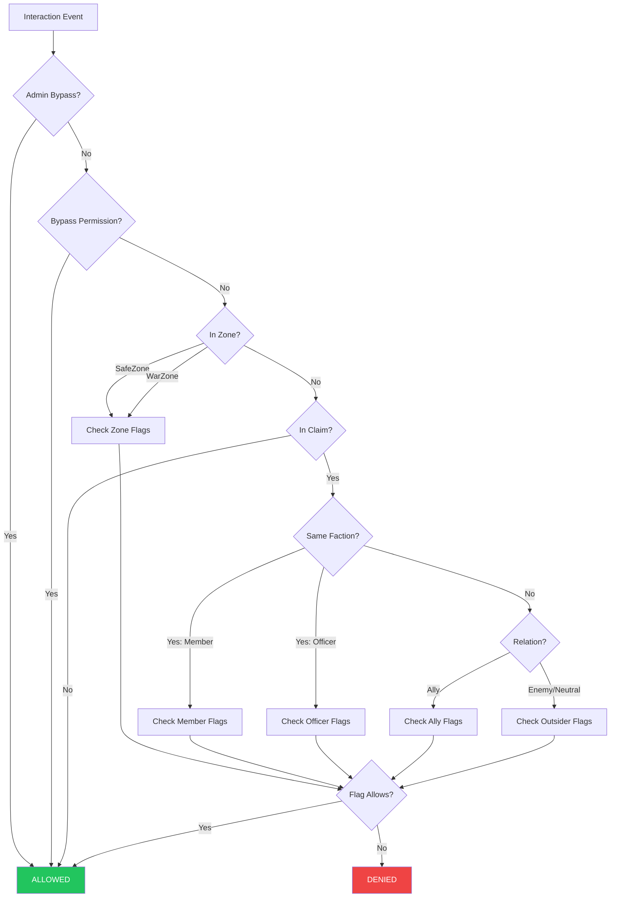

# HyperFactions Protection System

> **Version**: 0.10.0

Multi-layered protection controlling block interactions, PvP combat, damage types, and mob spawning based on zones, faction claims, and player relations.

## Quick Reference

| Question | Document |
|----------|----------|
| How do faction claim permissions work? | [protection-claims.md](protection-claims.md) |
| What are all 53 faction permission flags? | [protection-claims.md § Faction Permissions](protection-claims.md#faction-permissions-53-flags) |
| What config options affect claims? (`config/factions.json`) | [protection-claims.md § Server-Wide Configuration](protection-claims.md#server-wide-configuration) |
| What are the zone flags and defaults? | [protection-zones.md](protection-zones.md) |
| Which features need a mixin installed? | [protection-claims.md § Mixin-Dependent](protection-claims.md#mixin-dependent-claim-protections) |
| What works in zones but NOT in claims? | [protection-claims.md § Known Limitations](protection-claims.md#known-limitations--gaps) |
| How do explosions/fire spread work? | [protection-global.md § Explosions](protection-global.md#explosion-protection-matrix) |
| How do bypass permissions work? | [protection-global.md § Bypass Permissions](protection-global.md#bypass-permissions) |
| How does PvP protection work? | [protection-claims.md § PvP](protection-claims.md#pvp-in-claimed-territory) |
| Architecture and ECS systems? | [protection-systems.md](protection-systems.md) |
| Mixin bridge and hook slots? | [protection-systems.md § Mixin Bridge](protection-systems.md#mixin-bridge) |

## Documents

| Document | Audience | Contents |
|----------|----------|----------|
| **[protection-claims.md](protection-claims.md)** | Admins + Devs | 53 faction permission flags, defaults, parent-child hierarchy, check flows, config, server locks, GUI, mixin comparison, bug-prone areas |
| **[protection-zones.md](protection-zones.md)** | Admins + Devs | 40 zone flags, SafeZone/WarZone defaults, mixin-dependent flags, zone-exclusive features |
| **[protection-global.md](protection-global.md)** | Admins + Devs | Wilderness, explosions, fire spread, keep inventory, spawn protection, combat tags, death/power loss, bypass permissions, multi-world, integrations |
| **[protection-systems.md](protection-systems.md)** | Developers | Architecture, ECS systems, mixin bridge, hook slots, codec replacements, damage pipeline, debug tools, class reference |

## Overview



## Protection Priority

```
Zone > Claim > Wilderness
```

1. **Zones** — Admin SafeZone/WarZone flags (40 flags). Always checked first.
2. **Claims** — Faction permissions by role/relation (53 flags). Checked only when NOT in a zone.
3. **Wilderness** — No protection. All interactions allowed.

## Known Gaps (Bug Triage)

These are documented in detail in [protection-claims.md § Bug-Prone Areas](protection-claims.md#bug-prone-areas--known-gaps):

- **6 protections are zone-only** with no claim equivalent (keep inventory, durability, fall/environmental/projectile/mob damage)
- **Explosion 3-way combined check** — explosion hooks lack player context, so all 3 explosion flags are OR'd together (not per-source)
- **Backward-compat accessors bypass parent-child logic** — named methods like `outsiderBreak()` use `getRaw()` instead of `get()`

### Resolved in v0.10.0

The following gaps have been resolved with configurable settings in `config/factions.json`:

- Outsider pickup is now configurable via `claims.outsiderPickupAllowed` (was hardcoded deny)
- Outsider drop is now configurable via `claims.outsiderDropAllowed`
- Fire spread is now configurable via `claims.fireSpreadAllowed` (was hardcoded block)
- Explosions use 3 granular flags: `factionlessExplosionsAllowed`, `enemyExplosionsAllowed`, `neutralExplosionsAllowed` (was single `allowExplosionsInClaims`)
- Outsider entity damage has 3 flags: `factionlessDamageAllowed`, `enemyDamageAllowed`, `neutralDamageAllowed` (was hardcoded deny)
- Treasury flags are now exposed in TreasurySettingsPage GUI (was code-only)
